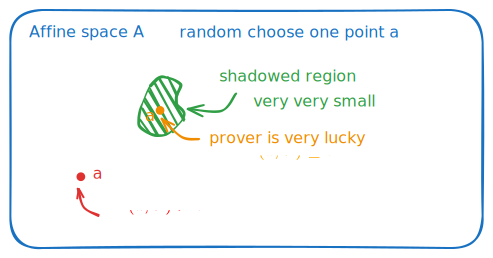
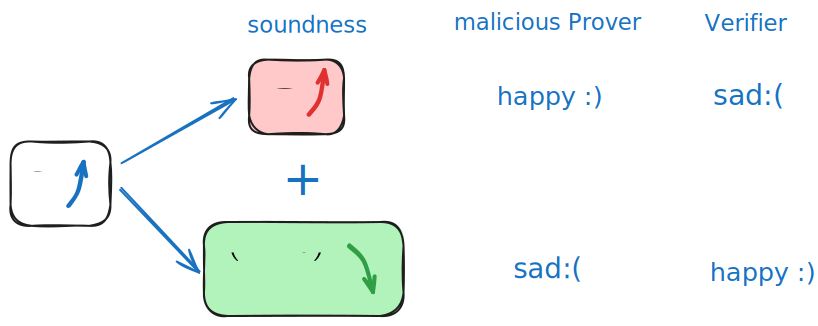

# Proximity Gaps：FRI 安全性证明的核心

- Jade Xie  <jade@secbit.io>
- Yu Guo <yu.guo@secbit.io>

本文主要受 [Proximity Gaps & Applications to Succinct Proofs](https://www.youtube.com/watch?v=8AMiZdWA1eM) 视频中的启发，介绍 Proximity Gaps 的概念，其在 FRI 安全性证明中起了非常重要的作用。

在 FRI 协议中，对于一个多项式 $f: \mathcal{D} \rightarrow \mathbb{F}_q$ ，设 $f(x) = a_0 + a_1 x + a_2 x^2 + \ldots + a_{k-1}x^{k-1}$ ，其是一个次数小于 $k$ 的多项式，将其在域 $\mathcal{D}$ 上进行求值，其中 $|\mathcal{D}| = n$ ，则 $f \in \text{RS}[\mathbb{F}_q, \mathcal{D}, k]$ 。Prover 想向 Verifier 证明 $f(x)$ 的次数确实是小于 $k$ 的。如果 $f \in \text{RS}[\mathbb{F}_q, \mathcal{D}, k]$ ，则 Verifier 输出 `accept` ，如果 $f$ 距离对应的编码空间 $\text{RS}[\mathbb{F}_q, \mathcal{D}, k]$ 有 $\delta$ 远，则输出 `reject` 。Verifier 能够获得的是关于一系列函数的 oracle ，FRI 协议想要实现的就是 Verifier 查询 oracle 尽可能的少，并能区分出 $f$ 属于上述哪一种情况。

不妨设 $k-1$ 为偶数，那么

$$
\begin{aligned}
    f(x) & = a_0 + a_1 x + a_2 x^2 + \ldots + a_{k-1}x^{k-1} \\
    & = (a_0 + a_2 x^2 + \cdots + a_{k-1}x ^{k-1}) + x (a_1 + a_3 x^2 + \cdots + a_{k-2}x^{k-3}) \\
    & := g(x^2) + xh(x^2) 
\end{aligned}
$$

可以发现函数 

$$
\begin{aligned}
    g(x) = a_0 + a_2 x + \cdots + a_{k-1}x ^{\frac{k-1}{2}} \\
    h(x) = a_1 + a_3 x + \cdots + a_{k-2}x^{\frac{k-3}{2}}
\end{aligned}
$$

开始 Prover 想向 Verifier 证明 $f(x)$ 的次数小于 $k$ ，现在可以分解成三个子问题：

1. 证明函数 $g(x)$ 的次数小于 $k/2$ ，即 $g(x) \in \text{RS}[\mathbb{F}_q, \mathcal{D}^{(1)}, k/2]$
2. 证明函数 $h(x)$ 的次数小于 $k/2$ ，即 $h(x) \in \text{RS}[\mathbb{F}_q, \mathcal{D}^{(1)}, k/2]$
3. 证明 $f(x) = g(x^2) + x \cdot h(x^2)$

其中 $|{D}^{(1)}| = n/2$ 。第三项是证明奇偶拆分是正确的。同样可以分别对 $g(x)$ 和 $h(x)$ 进行类似 $f(x)$ 那样奇偶项的分解，分别分解成两个次数小于 $k/4$ 的多项式，这样就要证明 4 个多项式的次数小于 $k/4$ ，直到最后分解到证明常数多项式。这个过程如下图所示，可以发现要证明的多项式在以 $2$ 的指数的形式增长。在这个过程中，为了证明奇偶拆分是没有问题的，需要发送关于所有这些多项式的 oracle 给 Verifier ，可以想象发送的多项式实在是太多了，随着 $k$ 的增加是爆炸性增长的。

既然我们的目的是证明多项式的次数小于某一个数，我们的想法是不希望对 $f(x)$ 分解问题时像上面那样分叉，分成两个多项式，我们想要下一步证明一个多项式次数小于 $k/2$ ，这样能大大减少发送的多项式。怎么做到这一点呢？我们可以向 Verifer 要一个随机数 $r \in \mathbb{F}$ ，将 $g(x)$ 和 $h(x)$ 作线性组合，得到 $g(x) + r \cdot h(x)$ ，将 $f(x)$ 的次数小于 $k$ 的问题分解为：

1. $f^{(1)}(x) = g(x) + r \cdot h(x)$ 的次数小于 $k/2$ ，即 $f^{(1)}(x) \in \text{RS}[\mathbb{F}_q, \mathcal{D}^{(1)}, k/2]$

这时发送的多项式的图形就变成下图这样了，可以看到要发送的多项式的 oracle 大大减少了。

那么现在剩下一个问题是，这样做是否和原来的方式等价呢？当然如果 Prover 是诚实的，根据 RS 编码的线性性，$g(x),h(x) \in \text{RS}[\mathbb{F}_q, \mathcal{D}^{(1)}, k/2]$ ，那么其线性组合之后依然是在 $\text{RS}[\mathbb{F}_q, \mathcal{D}^{(1)}, k/2]$ 中的。但如果 Prover 作弊呢？例如 $g(x)$ 距离编码空间 $\text{RS}[\mathbb{F}_q, \mathcal{D}^{(1)}, k/2]$ 有 $\delta$ 远，我们希望用随机数 $r$ 进行线性组合之后的 $g(x) + r \cdot h(x)$ 还是有 $\delta$ 这么远，这样 Verifier 能够发现 Prover 作弊。我们不希望的是折叠之后的 $g(x) + r \cdot h(x)$ 距离对应的编码空间变得更近了。Proximity Gaps 告诉我们发生这样的概率是非常小的，和中彩票一样，这样我们就可以大胆的用随机数进行折叠了。

## Proximity Gaps

上面我们考虑的是两个多项式折叠的情况，实际中我们会用到随机数一次进行多折或者对多个多项式进行 batch。这里我们不妨考虑一般的情况，假设有 $m$ 个向量 $(u_0, \ldots, u_{m-1})$ ，对每一个 $u_i \in \mathbb{F}_q^{\mathcal{D}}$ ，可以看作是 $\mathcal{D} \rightarrow \mathbb{F}$ 上的多项式，也可以看作是 $|\mathcal{D}| = n$ 维的向量。对这 $m$ 个向量进行线性组合，组成的空间我们称之为 affine space ，记作 $A = \text{span}\{u_0, \ldots, u_{m-1}\}$ 。记编码空间 $V := \text{RS}[\mathbb{F}, \mathcal{D},k]$ 。

我们关心 $A$ 中的元素与编码空间 $V$ 之间的距离关系是怎样的。如下图所示，将编码空间 $V$ 中的所有 code 表示为点，以这些点为圆心，以 $\delta$  为半径画一个球体。$A$ 形成的空间用一个二维平面表示，如果 $A$ 中的元素距离 $V$ 中的某些 code 之间的 Hamming 距离小于等于 $\delta$ ，就说明与图中的某些 Hamming 球之间有交集，将所有的这些交集并起来就形成了图中绿色的阴影区域。换句话说，对于阴影区域 $S \subset A$ 的每一个元素 $a$ ，一定存在一个 $v \in V$ ，使得 $\Delta(a, v) \leq \delta$ 。

Proximity Gaps 结论告诉我们要么 $A$ 中的所有的元素都在阴影区域里面，要么 $A$ 中只有很少的一部分元素在阴影区域中。不可能说 $A$ 中一半的元素在阴影区域，而另一半的元素不在阴影区域中。用公式表达就是只能符合下面两种情况之一：

1. $\Pr_{a \in A}[\Delta(a, V) \le \delta] \le \epsilon$
2. $\Pr_{a \in A}[\Delta(a, V) \le \delta] = 1$

我们称 $\delta$ 为 proximity 参数(proximity parameter)， $\epsilon$ 为误差参数(error parameter)，它是一个非常小的数。

那么这里的阴影区域代表什么呢？这个结论与 FRI 的安全性分析之间有什么关系呢？下面针对诚实的 Prover 和作弊的 Prover 这两种情况来应用 Proximity Gaps 结论进行分析。

### 诚实的 Prover

如果是诚实的 Prover ，那么对 $(u_0, \ldots, u_{m-1})$ 中的每一个向量都有 $u_i \in V$ 。

由 RS 编码的线性性，我们知道线性组合之后一定还在编码空间 $V$ 中，因此 $A \subset V$ ，此时 $A$ 中所有的元素都在 $V$ 中，那么 Verifier 进行随机线性组合之后，任意选取一点 $a \in A$ ，都能得到 $a \in V$ ，此时 Verifier 一定会接受。这种情况对应 Proximity Gaps 中的第二种情况，取 $\delta = 0$ ，此时

$$
    \Pr_{a \in A}[\Delta(a, V) = 0] = 1
$$

### 作弊的 Prover

如果 Prover 作弊，假设在 Prover 发送给 Verifier 的 $m$ 个向量 $\vec{u} = (u_0, \ldots, u_{m-1})$ 中混入了一个向量距离 $V$ 有 $\delta$ 远，即

$$
\exists u_i^* \in \vec{u}, \quad \Delta(u_i^*, V) > \delta
$$

那么在 $A = \text{span}\{u_0,u_1, \ldots,u_{m-1}\}$ 中，取 $a^* = u_i^* \in A$ ，肯定有

$$
\exists a^* \in A, \quad \Delta(a^*, V) > \delta
$$

此时根据 Proximity Gaps 结论，已经有 $A$ 中的一个元素不在阴影区域内了，因此排除 $\Pr_{a \in A}[\Delta(a, V) \le \delta] = 1$ 这种情况，只能是 $\Pr_{a \in A}[\Delta(a, V) \le \delta] \le \epsilon$ 。这也说明哪怕 $m$ 个向量中只有一个向量距离对应的编码空间有 $\delta$ 那么远， $A$ 中大部分元素都距离 $V$ 有 $\delta$ 那么远。换句话说，随机从 $A$ 中选取的一点 $a$ ，其与 $V$ 之间的距离能代表 $m$ 个向量中距离 $V$ 的最远距离。

现在 Verifier 就从 $A$ 中随机选取一点 $a \in A$ ，来检查 $\Delta(a,V)$ 是否大于 $\delta$ ，会出现两种情况。一种是选到了图中的阴影区域，另一种是选到阴影区域之外。

**情况 1 ： $\Delta(a, V) \le \delta$ 。** 此时 Verifier 选取的点 $a$ 在阴影区域内。我们说此时 Prover 非常幸运，虽然 Prover 提供了的错误的 witness ，即距离编码空间 $\delta$ 远，但是随机线性组合之后距离编码空间变得有 $\delta$ 那么近了，此时 Prover 能成功骗过 Verifer 。出现这种情况对 Verifier 来说不是好事，好在 Proximity Gaps 结论告诉我们 $\Pr_{a \in A}[\Delta(a, V) \le \delta] \le \epsilon$ ，也就是随便选一点能进入阴影区域的概率是非常非常小的，Prover 需要像中彩票那么幸运才行，也就是此时 Prover 能成功骗过 Verifier 的概率不会超过 $\epsilon$ 。

**情况 2 ： $\Delta(a, V) > \delta$ 。** 此时 Verifier 选取的点 $a$ 在阴影区域外。Prover 还有可能作弊成功吗？还是有的，因为 Verifer 收到了关于 $a$ 的 oracle ，但是不会去检查 $a$ 中的所有值，只想查询某一些值来看是否在 $V$ 中。如果 Verifier 只查询一次，由于 $\Delta(a, V) > \delta$ ，那么 $a$ 中有大于 $\delta$ 比例的分量与 $v$ 对应的分量不等，此时 Verifier 有大于 $\delta$ 的概率抓到 Prover 作弊，也就是说此时 Prover 能作弊成功的概率不超过 $1 - \delta$ 。

如果 Verifier 重复查询 $\kappa$ 次，此时 Prover 能作弊成功的概率不会超过 $(1 - \delta)^{\kappa}$ 。

那么，作弊的 Prover 能够成功的概率是上述两种情况的联合概率，即不会超过 

$$
\epsilon + (1 - \delta)^{\kappa}
$$

上面分析的思路其实就是一般 FRI 协议 soundness 分析的思路，论文中会将发生情况 1 叫做发生了一些“坏”的事件(“bad” event) ，然后假设“坏”的事件没有发生的情况下，估计情况 2 的概率，最后再将两个结合起来进行分析。

我们知道 FRI 协议分为两个阶段，一个是 Commit 阶段，另一个是 Query 阶段。我们可以将上述两种情况与这两个阶段对应起来：

1. 上述情况 1 发生在 Commit 阶段，Verifier 会选取随机数让 Prover 对多项式进行折叠。
2. 上述情况 2 对应发生在 Query 阶段，此时 Verifier 会随机选取一些点进行 query 检查。

如果是 batched 版本的 FRI 协议，想证明多个多项式 $f_0^{(0)}, f_1^{(0)}, \ldots, f_t^{(0)}$ ，都是小于 $k$ 次的多项式，可以先用随机数 $\{x_1,\ldots, x_t\}$ 进行聚合，得到

$$
f^{(0)}(x) = f_0^{(0)} + \sum_{i = 1}^{t} x_i \cdot f_i^{(0)}
$$

然后再对 $f^{(0)}(x)$ 应用一般的 FRI 协议，证明其是小于 $k$ 次的多项式。这里分析 soundness 也是对应上述情况 1 ，即可能存在由于随机数的选取导致 $f^{(0)}(x)$ 距离对应的 RS 编码空间变得不再有 $\delta$ 远。

## $\delta$ 增加带来的影响

下面分析下 proximity 参数 $\delta$ 的增加会带来什么影响？我们已经分析出作弊的 Prover 能成功骗过 Verifier 的概率不超过

$$
\epsilon + (1 - \delta)^{\kappa}
$$

这个概率由两部分组成， $\delta$ 的增加会导致：

1. $\epsilon \uparrow$。从图形上来理解，$\delta$ 控制了每个 Hamming 球的半径，如果 $\delta$ 增大，那么 Hamming 球变大，其与 affine space $A$ 之间的交集按理说就会更大，也就是阴影区域增大，这就意味着 $\epsilon$ 会变大。
   - 对作弊的 Prover 来说是好事 :） 。因为此时 Prover 变得比之前更加幸运了，有更大的概率进入绿色的阴影区域，能成功骗过 Verifier 了。
   - 自然，对 Verifier 来说是坏事 :( 。
2. $(1 - \delta)^{\kappa} \downarrow$。这个式子是直接和 $\delta$ 相关的，$\delta$ 增大，那么 $(1 - \delta)^{\kappa}$ 会变小。
   - 对作弊的 Prover 来说是坏事 :( 。因为此时 Prover 作弊成功的概率会变小。
   - 对 Verifier 来说是好事 :) 。 此时有更大的概率抓住 Prover 作弊。在达到相同的安全性要求下， Verifier 只需要更少的轮询次数就能达到要求了。
  
可以看到，$\delta$ 的增加使得 $\epsilon$ 变大， $(1 - \delta)^{\kappa}$ 变小，在实际中，$\epsilon$ 是非常小的，$(1 - \delta)^{\kappa}$ 在整个和式中所占比例更大，因此整体还是会变小的，这对于整个 FRI 协议来说，soundness 变小，也说明会更加安全。

上面是从 soundness 角度分析的，视频 [Proximity Gaps & Applications to Succinct Proofs](https://www.youtube.com/watch?v=8AMiZdWA1eM) 中还提到一点，$\delta$ 的增大会使得对应的 Correlated Agreement 相关结论变得更弱，这并不是好事。 下面就介绍下 Correlated Agreement 结论。

## Correlated Agreement

Correlated Agreement 说的是如果

$$
\Pr_{a \in A}[\Delta(a, V) \le \delta] > \epsilon
$$

那么存在 $\mathcal{D}' \subset \mathcal{D}$ ，以及 $v_0, \ldots, v_{m-1} \in V$ 使得

1. $\frac{|\mathcal{D}'|}{|\mathcal{D}|} \ge 1 - \delta$ ，
2. 对任意的 $i \in \{0, \ldots, m - 1\}$ ，有 $u_i|_{\mathcal{D}'} = v_i|_{\mathcal{D}'}$ 。

意思是如果落入阴影区域的元素很多，占比比 Proximity Gaps 结论中的误差参数 $\epsilon$ 还大的话，那么就会在区域 $\mathcal{D}$ 中存在一个占比很大(超过 $1 - \delta$ )的子集 $\mathcal{D}'$ ，在这里每个 $u_i$ 都能找到对应 $V$ 中的 $v_i$ 使得它们在 $\mathcal{D}'$ 上是一致的。

如果 $\delta$ 增大，那么 Correlated Agreement 结论里的第一条 $1 - \delta$ 就会变小了，这使得结论中能确保的存在 $V$ 中的 $v_i$ 与 $u_i$ 一致的子集 $\mathcal{D}'$ 变小了，使得得到的结论更弱了。

上面所说的 affine space $A$ 是 $\text{span}\{u_0, \ldots, u_{m-1}\}$ ，其实 $A$ 还可以是：
1. 线(lines)：$A = \{u_0 + z u_1: z \in \mathbb{F}\}$
2. 低次参数化曲线(low-degree parameterized curves)：$\text{curve}(\mathbf{u}) = \left\{u_z: = \sum_{i = 0}^{m-1}z^i \cdot u_i  | z \in \mathbb{F}_q   \right\}$
3. affine space：$u_0 + \text{span}\{u_1, \cdots, u_{m-1}\}$

对于上述三种情况，[BCIKS20] 中分别给出了对应的 Correlated Agreement 定理。在 [BCIKS20] 论文中说到，Correlated Agreement 定理([BCIKS20, 定理 1.6]) 可以推出 Proximity Gap 定理([BCIKS20, 定理 1.2])，但是 Proximity Gap 定理目前还不知道能否推出 Correlated Agreement 。

论文 [BCIKS20] 定理 8.3 就给出了 batched FRI 协议的 soundness，其中就用到了 Correlated Agreement 定理。

## 总结

Proximity gap 在 FRI 协议中起着至关重要的作用，它能让我们放心的用随机数对多项式进行折叠，这大大减少了 Prover 发送 oracle 的数量，同时也减少了 Verifier 查询的数量。此外，Proximity gap 和 Correlated Agreement 定理密切相关，并且在 FRI 的 soundness 分析中起到了关键作用。

## References

- [BCIKS20] Eli Ben-Sasson, Dan Carmon, Yuval Ishai, Swastik Kopparty, and Shubhangi Saraf. Proximity Gaps for Reed–Solomon Codes. In *Proceedings of the 61st Annual IEEE Symposium on Foundations of Computer Science*, pages 900–909, 2020.
- 视频：[Proximity Gaps & Applications to Succinct Proofs](https://www.youtube.com/watch?v=8AMiZdWA1eM)
