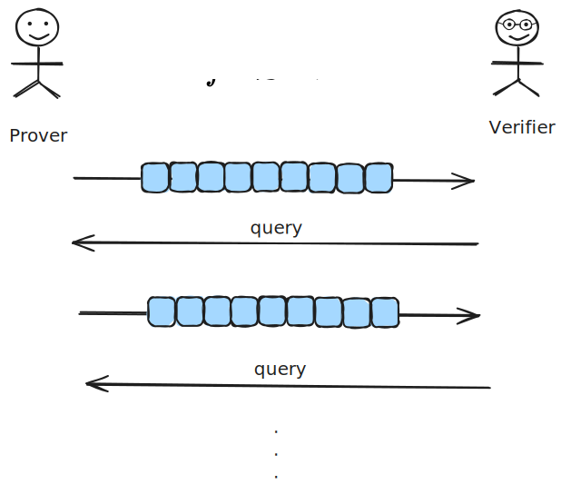
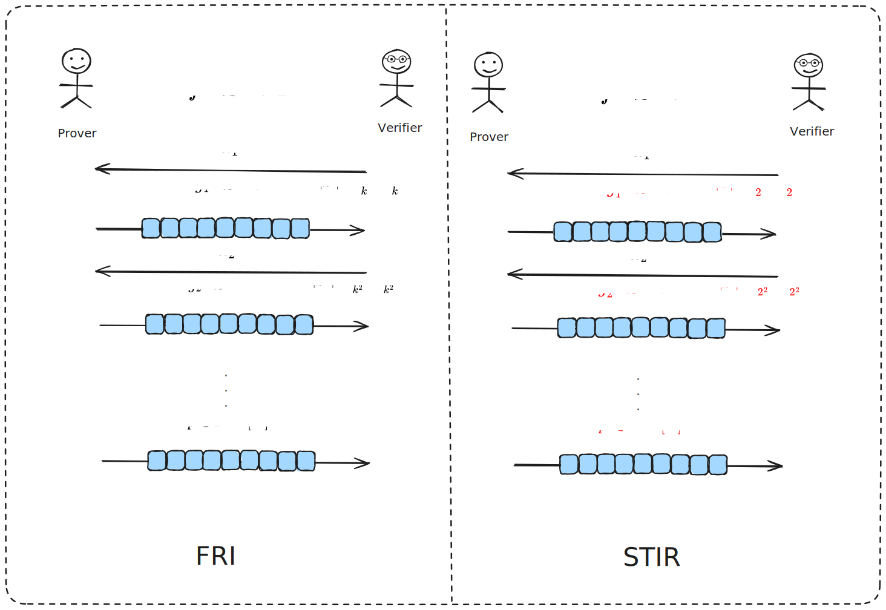
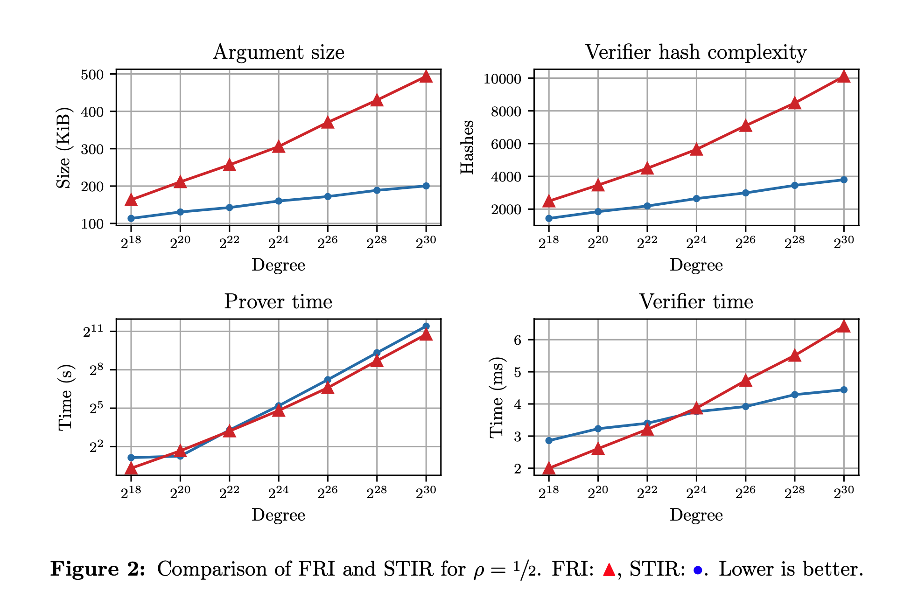
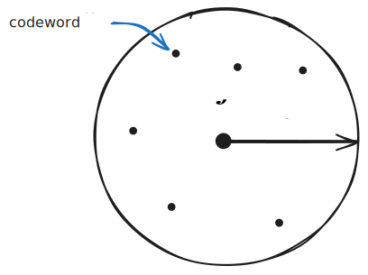
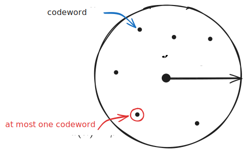
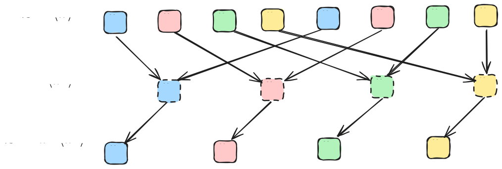
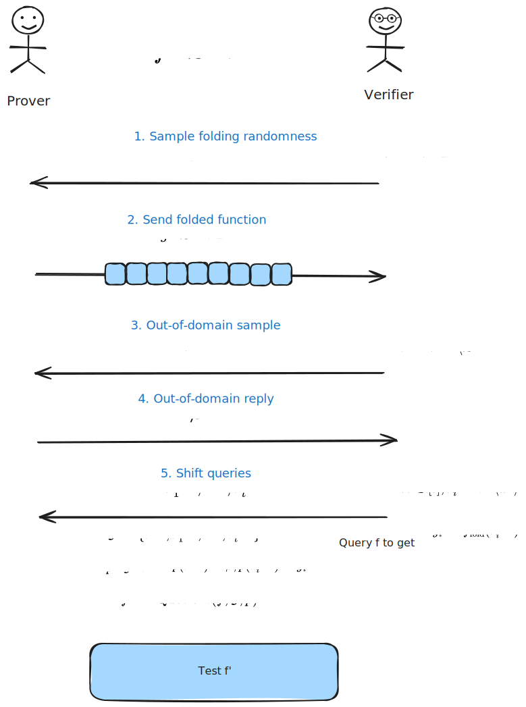

# STIR: 提升码率来降低查询复杂度

- Jade Xie  <jade@secbit.io>
- Yu Guo <yu.guo@secbit.io>

本文主要受 [STIR 论文](https://eprint.iacr.org/2024/390) 作者的博客文章 [STIR: Reed–Solomon Proximity Testing with Fewer Queries](https://gfenzi.io/papers/stir/) 与演讲 [ZK11: STIR: Reed–Solomon Proximity Testing with Fewer Queries - Gal Arnon & Giacomo Fenzi](https://www.youtube.com/watch?v=OLklJjp8KB4&ab_channel=ZeroKnowledge) 的启发，介绍 STIR 协议。

STIR 和 FRI 一样，也是解决 Reed-Solomon Proximity Testing 问题，不过与 FRI 相比，其有更低的查询复杂度，这会降低 argument 的大小与 Verifier 的哈希复杂度。那么 STIR 是如何实现这一点的呢？其实谜底就在谜面上，STIR 取了 **S**hift **T**o **I**mprove **R**ate 的首字母，STIR 的核心点就在其通过每次移动 evaluation domain，来提升码率。直观地理解，码率实际刻画的是码字中所含的真实信息的比例，码率降低，真实信息减少，对应码字中的冗余就增大了，Verifier 就更容易测试接受到的一个消息到该编码空间的 proximity 了，其测试能力变得更强了。换句话说，由于 Verifier 的测试能力变强，那么其只需要更少的查询次数就能达到目标的安全性了。下面通过对比 FRI 和 STIR，来看看 STIR 是如何降低码率的。

## FRI v.s. STIR

对于一个有限域 $\mathbb{F}$ ，取 $\mathcal{L} \subseteq \mathbb{F}$ 为 evaluation domain，设其大小 $|\mathcal{L}| = n$，用 $d$ 表示次数界限(不妨设 $n$ 与 $d$ 都是 $2$ 的幂次)，那么 Reed-Solomon 编码空间 $\mathrm{RS}[\mathbb{F},\mathcal{L},d]$ 包含的是所有这样的函数 $f: \mathcal{L} \rightarrow \mathbb{F}$ ，函数 $f$ 能与一个次数严格小于 $d$ 的多项式在 $\mathcal{L}$ 上的求值完全一致。码率 $\rho := d/|\mathcal{L}|$ 。

协议的目标是解决 Reed-Solomon Proximity Testing 问题，其中 Verifier 是可以通过查询获得一个函数 $f: \mathcal{L} \rightarrow \mathbb{F}$ 的，那么 Verifier 的目标就是在尽可能少的位置上查询 $f$ 的值，能够区分出 $f$ 属于下面哪一种情况：
1. $f$ 是一个 Reed-Solomon 码字，即 $f \in \mathrm{RS}[\mathbb{F},\mathcal{L},d]$ ；
2. $f$ 距离 Reed-Solomon 编码空间 $\mathrm{RS}[\mathbb{F},\mathcal{L},d]$ 中的所有码字的相对 Hamming 距离都有 $\delta$ 那么远，即 $\Delta(f, \mathrm{RS}[\mathbb{F},\mathcal{L},d]) > \delta$ 。

我们在 IOPP(Interactive Oracle Proofs of Proximity) 模型下考虑上述 Reed-Solomon Proximity Testing 问题，此时 Verifier 可以和 Prover 进行交互，并且能通过 oracle 获得 Prover 的消息，如下图所示。

Verifier 通过与 Prover 一系列交互之后，分两种情况：
* $f \in \mathrm{RS}[\mathbb{F},\mathcal{L},d]$ ，Verifier 接受 :)
* $\Delta(f, \mathrm{RS}[\mathbb{F},\mathcal{L},d]) > \delta$ ，Verifier 大概率拒绝 :(

我们在 $k$ 折的情况下对比 FRI 协议和 STIR 协议，如下图所示。

在 FRI 协议中，假设 $g_1$ 是通过随机数 $\alpha_1$ 进行 $k$ 折得到的，其中 $\mathcal{L}^{k} = \{x^k,x\in \mathcal{L}\}$ 。因此将测试 $f \in \mathrm{RS}[\mathbb{F},\mathcal{L},d]$ 转换为 $g_1 \in \mathrm{RS}[\mathbb{F},\mathcal{L}^k,d/k]$ ，递归地来测试 $g_i \in \mathrm{RS}[\mathbb{F},\mathcal{L}^{k^i},d/k^i]$ 。因此在第 $i$ 轮，其码率

$$
\rho_i = \frac{\frac{d}{k^i}}{|\mathcal{L}_i|} = \frac{d}{k^i} \cdot \frac{k^i}{n} = \frac{d}{n} = \rho
$$

可以发现在每一轮中，码率 $\rho_i$ 始终为 $\rho$ ，保持不变。

而在 STIR 协议中，注意 $g_1'$ 仍然是 $k$ 折，但是其 evaluation domain $\mathcal{L}'$ 的大小却不是缩小 $k$ 倍，而是 $2$ 倍。此时将测试 $f \in \mathrm{RS}[\mathbb{F},\mathcal{L},d]$ 转换为测试 $g_1' \in \mathrm{RS}[\mathbb{F},\mathcal{L}',d/k]$ 。那么在第 $i$ 轮，需要测试 $g_i' \in \mathrm{RS}[\mathbb{F},\mathcal{L}_{i}',d/k^i]$ 。这时

$$
\rho_i = \frac{\frac{d}{k^i}}{|\mathcal{L}'_i|} = \frac{d}{k^i} \cdot \frac{2^i}{n} = \left( \frac{2}{k}\right)^i \cdot \frac{d}{n} = \left( \frac{2}{k}\right)^i \cdot \rho
$$

如果 $\frac{2}{k} < 1$ 即 $k > 2$ ，可以发现码率 $\rho_{i}$ 每一轮都在减小，这就是 STIR 降低查询复杂的关键之处。

当我们将上述的 IOPP 编译成 SNARK 时，需要用到 BCS 转换 ([BCS16], BCS transformation) ，分为两步：

1. 将 Prover 的消息进行 Merkle 承诺，当 Verifier 想要查询时就打开这些承诺，这一步将 IOPP 转换为了一个简洁的交互论证(succinct interactive argument) 。
2. 使用 Fait-Shamir 转换将第一步得到的简洁的交互论证转换为非交互的。

在BCS转换中，就需要 IOPP 有一个比较强的 soundness 性质，称为 round-by-round soundness，意思是要求 IOPP 在每一轮有比较小的 soundness error，这比要求整个 IOPP 有比较小的 soundness error 要求更强。我们假设要求 round-by-round soundness error 的界为 $2^{-\lambda}$ 。每一轮可以重复查询 $t_{i}$ 次，整个 IOPP 协议进行 $M$ 轮，那么整个证明的总查询复杂度就为 $\sum_{i = 0}^M t_i$ 。对于 $\delta$ 达到 Johnson bound，即 $\delta = 1 - \sqrt{\rho}$ ，通过计算可以得到

1. FRI 的查询复杂度为：

    $$
        O \left( \lambda \cdot \frac{\log d}{- \log \sqrt{\rho}} \right)
    $$

2. STIR 的查询复杂度为：

    $$
        O \left( \lambda \cdot \log \left( \frac{\log d}{- \log \sqrt{\rho}} \right) + \log d \right)
    $$
    
在 STIR 查询复杂度中，$d$ 通常不大，因此占比比较大的是第一项 $\lambda \cdot \log \left( \frac{\log d}{- \log \sqrt{\rho}} \right)$ ，可以发现其是 $\log \log$ 级别的，而原来的 FRI 只是 $\log$ 级别。

在论文 [ACFY24] 6.4 节中的图 2 给出了 FRI 和 STIR 的对比试验结果，可以发现 STIR 降低查询复杂度导致了其在 argument 大小和 Verifier 计算的哈希数量相比 FRI 更优。这也比较好理解，更少的查询复杂度意味着：

1. 减少整个 argument 大小是显然的。
2. 由于查询次数更少，那么 Verifier 需要打开的 Merkle 承诺就更少，计算对应的哈希数量就更少。

## 关于 RS 编码的强有力的工具

在这里先引入几个关于 RS 编码的强大工具，其能帮助我们理解具体的 STIR 协议构造。

### Folding

对于一个函数 $f: \mathcal{L} \rightarrow \mathbb{F}$ ，给一个随机数 $r \in \mathbb{F}$ ，其 $k$ 次折叠之后的函数记为 $f_r := \mathrm{Fold}(f,r) : \mathcal{L}^{k} \rightarrow \mathbb{F}$ 。其定义为，对于每一个 $x \in \mathcal{L}^{k}$ ，在 $\mathcal{L}$ 中能找到 $k$ 个 $y$ 满足 $y^k = x$ ，由 $k$ 对 $(y, f(y))$ 可以得到唯一的一个次数小于 $k$ 的多项式 $\hat{p}$ ，其满足 $\hat{p}(y) = f(y)$ ，那么 $\hat{p}(r)$ 就是函数 $f_r(x)$ 的值。这个 Fold 函数的定义和 FRI 协议中的 Fold 函数定义完全一致，其有两个很好的性质。

第一个性质是距离的保持。

1. 如果折叠前的函数 $f \in \mathrm{RS}[\mathbb{F}, \mathcal{L}, d]$ ，那么对于任意选取的随机数 $r \in \mathbb{F}$ ，都有折叠之后的函数依然是 RS 码，即 $f_r \in \mathrm{RS}[\mathbb{F}, \mathcal{L}^k, d/k]$ 。
2. 对于 $\delta \in (0, 1 - \sqrt{\rho})$ ，如果 $f$ 距离 $\mathrm{RS}[\mathbb{F}, \mathcal{L}, d]$ 有 $\delta$ 远，那么以至少 $1 - \mathrm{poly}(|\mathcal{L}|)/\mathbb{F}$ 的概率对随机数 $r$ 进行选择，有 $f_r$ 距离 $\mathrm{RS}[\mathbb{F}, \mathcal{L}^k, d/k]$ 有 $\delta$ 远。

这个性质保证了我们可以大胆进行折叠，如果 Prover 作弊，提供了距离编码空间有 $\delta$ 远的函数，极大概率其折叠之后的函数依然距离对应的编码空间有 $\delta$ 远。

第二个性质称为 Local，意思是如果要得到折叠后的函数在任意一点的值，只需要查询 $f$ 在 $k$ 个点的值就能计算得出，因为此时可以得到唯一一个次数小于 $k$ 的多项式 $\hat{p}$ ，再带入  $r$ 计算得到 $\hat{p}(r)$ 就是该点的值。此时 Prover 也不需要单独提供 $\mathrm{Fold}(f,r)$ 的 oracle 了，Verifier 通过访问 $f$ 的 oracle 就能得到了，这就减少了 argument 大小。

### Quotienting

对于函数 $f: \mathcal{L} \rightarrow \mathbb{F}$ ，以及 $p: S \rightarrow \mathbb{F}$ ，其中 $S \subseteq \mathbb{F}$ ，则关于函数 $f$ 的 quotient 定义为：

$$
\mathrm{Quotient}(f, S, p)(x) := \frac{f(x) - \hat{p}(x)}{\prod_{a \in S}(X - a)},
$$

其中 $\hat{p}$ 是满足对任意的 $a \in S$ ，都有 $\hat{p}(a) = p(a)$ 的次数小于 $|S|$ 的唯一的多项式。

该函数的一个重要性质是一致性(Consistency) ，假设 $S$ 与 $\mathcal{L}$ 不相交(其实也可以相交，结论会更复杂些，见[ACFY24] Lemma 4.4)，那么

1. 如果 $f \in \mathrm{RS}[\mathbb{F}, \mathcal{L}, d]$ ，其是一个次数小于 $d$ 的多项式在 $\mathcal{L}$ 上的 evaluation，并且该多项式在 $S$ 上与 $p$ 一致，那么 $\mathrm{Quotient}(f, S, p) \in \mathrm{RS}[\mathbb{F}, \mathcal{L}, d - |S|]$ 。
2. 如果对于任意一个离 $f$ 有 $\delta$ 近的次数小于 $d$ 的多项式 $\hat{u}$ ，都有 $\hat{u}$ 与 $p$ 在 $S$ 上不完全一致，即对于一些 $a \in S$ ，有 $\hat{u}(a) \neq p(a)$ ，那么 $\mathrm{Quotient}(f, S, p)$ 距离 $\mathrm{RS}[\mathbb{F}, \mathcal{L}, d - |S|]$ 就有 $\delta$ 远。

对于上述第 2 点，在 $f$ 的 $\delta$ 范围内的码字 $\hat{u}$ ，这些码字组成的集合记为 $\mathrm{List}(f,d,\delta)$ 。对于任意的 $\hat{u} \in \mathrm{List}(f,d,\delta)$ ，只要在 $S$ 上有一点，使得 $\hat{u}(a) \neq p(a)$ ，商多项式 $\mathrm{Quotient}(f, S, p)$ 的距离就被放大了，就有 $\delta$ 那么远了，也就是如果这里被除了错误的值 $f(a) - p(a)$ ，商多项式距离低次多项式所在的 RS 编码空间就很远了。

注意到这里要求任意的 $\hat{u} \in \mathrm{List}(f,d,\delta)$ ，都有 $\hat{u}$ 与 $p$ 在 $S$ 上不一致。而用 Out of Domain Sampling 的方法，我们可以将 $f$ 在 $\delta$ 范围内的码字以极大概率限制到最多一个，这会使得 Verifier 更容易去检测。我们将在下一小节详细介绍该方法。

$\mathrm{Quotient}$ 函数可以帮助我们实现在函数 $f$ 上添加约束。例如想限制 $f$ 在点 $a$ 处的值为 $b$ ，那么可以通过 $\mathrm{Quotient}(f, \{a\}, p)$ 来实现，其中 $p(a) = b$ ，即

$$
\mathrm{Quotient}(f, \{a\}, p) = \frac{f(x) - p(x)}{x - a} 
$$

接着证明 $\mathrm{Quotient}(f, \{a\}, p) \in \mathrm{RS}[\mathbb{F}, \mathcal{L}, d - 1]$ 就可以了。如果 Prover 提供的 $f$ 在 $a$ 点的值不为 $b$ ，即 $f(a) \neq b$ ，那么 $f(a) \neq p(a)$ ，就会导致 $\mathrm{Quotient}(f, \{a\}, p)$ 距离 $\mathrm{RS}[\mathbb{F}, \mathcal{L}, d - 1]$ 有 $\delta$ 远，就容易被 Verifier 检测出来了。这里只添加了一个约束，自然可以添加多个约束，这样就能在 $f$ 添加约束的同时将测试 $f$ 转换为测试 $\mathrm{Quotient}$ 函数距离对应的 RS 编码空间有 $\delta$ 近了。

$\mathrm{Quotient}$ 函数和折叠函数一样有 Local 性质。要计算 $\mathrm{Quotient}$ 函数在点 $x \in \mathcal{L}\backslash\mathcal{S}$ 的值，通过查询函数 $f$ 在 $x$ 点的值就可以计算得出。

### Out of Domain Sampling

Out of Domain Sampling 是一种强大的工具，其可以帮助我们限制 Prover 提供的函数 $f$ 在 $\delta$ 范围内的码字数量，这样就就可以将 List Decoding 转换为 Unique Decoding 了。

对于函数 $f: \mathcal{L} \rightarrow \mathbb{F}$ ，Verifier 从区域 $\mathcal{L}$ 之外随机选取一个数 $\alpha \in \mathbb{F} \backslash \mathcal{L}$ ，Prover 返回值 $\beta$ ，那么在 $f$ 的 $\delta$ 范围内的码字列表 $\mathrm{List}(f,d,\delta)$ 中，大概率最多只有一个码字 $\hat{u}$ 满足 $\hat{u}(\alpha) = \beta$ 。

可以用代数基本定理来说明这一点。我们只要证明在 $\mathrm{List}(f,d,\delta)$ 中存在两个不同的码字 $\hat{u}'$ 与 $\hat{u}$ ，它们在 $\alpha$ 点的值都相等的概率比较小就可以了，这也就说明了大概率最多有一个码字满足 $\hat{u}(\alpha) = \beta$ 。

先固定两个不同的码字 $\hat{u}'$ 与 $\hat{u}$ ，由于它们是不同的码字并且次数都小于 $d$ ，则由代数基本定理可以得到

$$
\Pr_{\alpha \leftarrow \mathbb{F} \backslash \mathcal{L}} [\hat{u}'(\alpha) = \hat{u}(\alpha)] \le \frac{d - 1}{|\mathbb{F}| - |\mathcal{L}|}
$$

假设 $\mathrm{RS}[\mathbb{F}, \mathcal{L},d]$ 是 $(\delta, l)$ 可列表解码的，意思就是在 $\delta$ 范围内的码字数量最多为 $l$ 个，那么任意选取不同的两个码字 $\hat{u}'$ 与 $\hat{u}$ 的选法就有 $\binom{l}{2}$ 种。因此任意选取两个不同的码字 $\hat{u}'$ 与 $\hat{u}$ ，它们在 $\alpha$ 点的值相等的概率不超过 $\binom{l}{2} \cdot \frac{d - 1}{|\mathbb{F}| - |\mathcal{L}|}$ 。这个概率是非常小的，因此得证。

如何去限制 Prover 发送过来的 $\beta$ 真的是 $f$ 在点 $a$ 处的值呢？用上一小节引入的工具 Quotient 就能做到啦。

## 深入 STIR 协议的一次迭代

在这一节中将应用前面提到的三个工具，深入 STIR 协议中的一次迭代。

目标：

- 初始给定一个函数 $f$ ，想证明其在 $\mathrm{RS}[\mathbb{F},\mathcal{L},d]$ 中，其中 $\mathcal{L} =\langle \omega \rangle$ 。
- 经过一次迭代后，证明函数 $f' \in \mathrm{RS}[\mathbb{F},\mathcal{L}',d/k]$ ，其中 $\mathcal{L}' = \omega \cdot \langle \omega^2 \rangle$ 。

也就是函数 $f$ 进行了 $k$ 折，其次数降为 $d/k$ ，但是一次迭代后的函数 $f'$ 的 evaluation domain $\mathcal{L}'$ 的大小并不是缩小 $k$ 倍，而是 $2$ 倍。这就是前面提到的 STIR 协议的核心思想，通过提升码率来降低查询复杂度。

关于 evaluation domain $\mathcal{L} =\langle \omega \rangle$ 与 $\mathcal{L}' = \omega \cdot \langle \omega^2 \rangle$ ，这里举一个例子来说明。假设 $\omega^8 = 1$ 。

这样构造的 $\mathcal{L}'$ 相比 $\mathcal{L}$ 大小减少了一半，但其实 $\langle \omega^2 \rangle$ 也能满足减少一半的要求，为什么不选择 $\mathcal{L}' = \langle \omega^2 \rangle$ 呢？假设我们进行 $k = 4$ 折，我们能保证 $\mathcal{L}^4 = \{\omega^4, \omega^8\}$ 与 $\mathcal{L}' = \{\omega^1, \omega^3,\omega^5, \omega^7\}$ 不相交。这样做的好处是能避免构造 $\mathcal{L}^4 \cap \mathcal{L}'$ 中的相交点定义的函数 $\mathrm{Fill}$ ，这样 Verifier 就不用额外检查 $\mathrm{Fill}$ 的函数值是否正确了([ACFY24] Remark 5.3 说明了这一点)。

一次迭代的协议流程如下图所示：

1. 取样折叠随机数(Sample folding randomness): Verifier 先从 $\mathbb{F}$ 中随机选取一个数 $r^{\mathrm{fold}}$ ，这个随机数将用于折叠函数 $f$ 。
2. 发送折叠函数(Send folded function): Prover 发送折叠后的函数 $g: \mathcal{L}' \rightarrow \mathbb{F}$ 。如果 Prover 是诚实的，那么函数 $g$ 是多项式 $\hat{g}$ 在 $\mathcal{L}'$ 上的 evaluation 。这里 evaluation 的意思就是 $g$ 与 $\hat{g}$ 在 $\mathcal{L}'$ 上的值完全一致，而多项式 $\hat{g}$ 是通过 $\mathrm{Fold}(f, r^{\mathrm{fold}})$ 得到的。首先用随机数 $r^{\mathrm{fold}}$ 对函数 $f$ 进行 $k$ 次折叠，得到了 $\mathrm{Fold}(f, r^{\mathrm{fold}}) : \mathcal{L}^k \rightarrow \mathbb{F}$ ，此时折叠函数的取值范围是 $\mathcal{L}^k$ ，我们想要的是在 $\mathcal{L}'$ 上取值，这时只需将 $\mathrm{Fold}(f, r^{\mathrm{fold}})$ 的定义域扩展(extension) 到 $\mathcal{L}'$ 上即可，就得到了多项式 $\hat{g}: \mathcal{L}' \rightarrow \mathbb{F}$ ，其次数小于 $d/k$ 。
3. Out-of-domain sample: Verifier 从 $\mathbb{F}\backslash \mathcal{L}'$ 中取一个随机数 $r^{\mathrm{out}}$ ，发送给 Prover 。
4. Out-of-domain reply: Prover 答复 $\beta \in \mathbb{F}$ 。如果 Prover 是诚实的，那么 $\beta := \hat{g}(r^{\mathrm{out}})$ 。

> 📝 **Notes**
> 这里第 3 步和第 4 步的目的是为了用 Out of domain Sampling 来将 $g'$ 在 $\delta$ 范围内的码字数量限制为最多一个，能将列表解码转换为唯一解码。

5. Shift queries: Verifier 从 $\langle \omega^k \rangle$ 中选取 $t$ 个随机数，即 $\forall i \in [t],r_i^{\mathrm{shift}} \leftarrow \langle \omega^k \rangle$ 。根据折叠函数的 Local 性质，Verifier 通过查询 $f$ 可计算得到 $y_i := f_{\mathrm{fold}}(r_i^{\mathrm{shift}})$ ，其中 $f_{\mathrm{fold}} :=\mathrm{Fold}(f, r^{\mathrm{fold}})$ 。

在第 2 步中 Prover 发送了 $g: \mathcal{L}' \rightarrow \mathbb{F}$ 并且 Prover 声称其与 $\mathrm{Fold}(f, r^{\mathrm{fold}})$ 在 $\mathcal{L}'$ 上的取值是一致的，但是 Verfier 无法直接查询折叠函数在 $\mathcal{L}'$ 上的值， Verifier 只能通过查询 $f$ 的方式来计算得到 $\mathrm{Fold}(f, r^{\mathrm{fold}})$ 在 $\mathcal{L}^k$ 上的取值。好在这里可以用到 Quotient 工具来保证一致性。

在第 3 步和第 4 步先用 Out-of-domain Sampling 的方法限制 $g$ 在 $\delta$ 范围内的码字数量最多为一个，设为 $\hat{u}$ ，然后在第 5 步查询  $\mathrm{Fold}(f, r^{\mathrm{fold}})$ 在 $\mathcal{L}^k$ 上的值，这里方便后续验证 $\hat{u}$ 与折叠函数在 $\mathcal{L}^k$ 上的值是否一致。验证是否一致就交给 Quotient 函数了。

将所有这些要确保一致性的点组成集合 $\mathcal{G} := \{r^{\mathrm{out}},r_1^{\mathrm{shift}}, \ldots, r_t^{\mathrm{shift}}\}$ ，然后定义函数 $p: \mathcal{G}\rightarrow \mathbb{F}$ ，其满足：

$$
p(r^{\mathrm{out}}) = \beta,
$$

$$
p(r_i^{\mathrm{shift}}) = y_i.
$$

定义下一步的函数 $f'$ 为

$$
f' := \mathrm{Quotient}(f, \mathcal{G}, p) = \frac{g(x) - \hat{p}(x)}{\prod_{a \in \mathcal{G}}(X - a)}.
$$

由于 Quotient 函数具有 Local 性质，因此想要计算 $f'$ 在 $\mathcal{L}'$ 上的值，只需要查询 $g$ 在 $\mathcal{L}'$ 上的值就可以了。

至此，接下来测试 $f'$ 距离 $\mathrm{RS}[\mathbb{F},\mathcal{L}',d/k]$ 是否有 $\delta$ 近就可以了。

细看 $f'$ 的公式，可以发现 Prover 诚实情况下 $f' \in \mathrm{RS}[\mathbb{F}, \mathcal{L}', d/k - |\mathcal{G}|]$ ，这里其实出现了多项式次数的降低，需要进行次数校正 (degree correction) ，将 $f'$ 的次数校正为 $d/k$ 。关于这一点将在后文进行介绍。

## Soundness 分析

在本小节将对一次迭代进行 soundness 分析，即如果 Prover 作弊， $f$ 距离 $\mathrm{RS}[\mathbb{F},\mathcal{L},d]$ 有 $\delta$ 远，来分析 $f'$ 距离 $\mathrm{RS}[\mathbb{F},\mathcal{L}',d/k- |\mathcal{G}|]$ 也比较远的概率。[ACFY24] Lemma 1 给出了如下的结论：

**命题 1** [ACFY24, Lemma 1] 如果 $f$ 距离 $\mathrm{RS}[\mathbb{F},\mathcal{L},d]$ 有 $\delta$ 远，那么除了概率为 $(1 - \delta)^t +  \mathrm{poly}(|\mathcal{L}|)/|\mathbb{F}|$ 的情况，$f'$ 距离 $\mathrm{RS}[\mathbb{F},\mathcal{L}',d/k- |\mathcal{G}|]$ (大约) 有 $(1 - \sqrt{\rho'})$ 远。

证明思路：

1. 根据折叠函数保持距离的性质，对 $f$ 用随机数 $r^{\mathrm{fold}}$ 折叠之后得到的函数 $f_{r^{\mathrm{fold}}} := \mathrm{Fold}(f, r^{\mathrm{fold}})$ 距离 $\mathrm{RS}[\mathbb{F},\mathcal{L}^k,d/k]$ 有 $\delta$ 远的概率超过 $1 - \mathrm{poly}(|\mathcal{L}|/|\mathbb{F}|)$ 。
2. 根据 Out-of-domain Sampling 的性质，$g$ 在 $1 - \sqrt{\rho'}$ 范围内最多有一个码字 $\hat{u}$ 满足 $\hat{u}(r^{\mathrm{out}}) = \beta$ 的概率超过 $1 - \mathrm{poly}(|\mathcal{L}|)/|\mathbb{F}|$ 。

现在分析下第 2 点，函数 $g: \mathcal{L}' \rightarrow \mathbb{F}$ ，现在考虑其与编码空间 $\mathrm{RS}[\mathbb{F}, \mathcal{L}', d/k]$ 的距离。根据 Johnson 界，$\mathrm{RS}[\mathbb{F}, \mathcal{L}', d/k]$ 是 $(\gamma, l)$ - 可列表解码(list-decodable)的，其中 $\gamma \approx 1 - \sqrt{\rho'}$ , $l = \mathrm{poly}(|\mathcal{L}'|) =\mathrm{poly}(|\mathcal{L}|)$ ，也就是最多有 $l$ 个次数小于 $d/k$ 的多项式距离 $g$ 不超过 $\gamma$ 。那么在 $l$ 个多项式中任意选取两个不同的多项式 $\hat{u}'$ 与 $\hat{u}$ ，从 $\mathbb{F} \backslash \mathcal{L}'$ 中选取随机数 $r^{\mathrm{out}}$ ，它们在 $r^{\mathrm{out}}$ 点的值都等于 $\beta$ 的概率不超过 $\frac{d/k - 1}{|\mathbb{F}| - |\mathcal{L}'|}$ 。这两个多项式的选取方法有 $\binom{l}{2}$ 种，因此这个概率不超过

$$
\binom{l}{2} \cdot \frac{d/k - 1}{|\mathbb{F}| - |\mathcal{L}'|} = O\left(\frac{l^2 \cdot (d/k - 1)}{|\mathbb{F}| - |\mathcal{L}'|}\right) = \mathrm{poly}(|\mathcal{L}|)/|\mathbb{F}|.
$$

因此 $g$ 在 $1 - \sqrt{\rho'}$ 范围内最多有一个码字 $\hat{u}$ 满足 $\hat{u}(r^{\mathrm{out}}) = \beta$ 的概率超过 $1 - \mathrm{poly}(|\mathcal{L}|)/|\mathbb{F}|$ 。

如果第 1 项和第 2 项都成立，那么这个概率超过 $1 - \mathrm{poly}(|\mathcal{L}|)/|\mathbb{F}|$ ，现在只需证明 $f'$ 距离 $\mathrm{RS}[\mathbb{F},\mathcal{L}',d/k- |\mathcal{G}|]$ (大约) 有 $(1 - \sqrt{\rho'})$ 远的概率至少为 $1 - (1 - \delta)^t$ 即可。

下面分两种情况进行讨论：

* 如果在第 2 项中没有码字满足要求，即在 $g$ 的 $1 - \sqrt{\rho'}$ 范围内没有码字满足 $\hat{u}(r^{\mathrm{out}}) = \beta$ ，而根据协议的构造，$p(r^{\mathrm{out}}) = \beta$ 。因此对于 $g$ 的 $1 - \sqrt{\rho'}$ 范围内的任意一个码字有 $\hat{u}(r^{\mathrm{out}}) \neq p(r^{\mathrm{out}})$ 。由于

    $$
    f' := \mathrm{Quotient}(g, \mathcal{G}, p) = \frac{g(x) - \hat{p}(x)}{\prod_{a \in \mathcal{G}}(X - a)}.
    $$

    根据 Quotient 函数的一致性，此时 $\hat{u}$ 与 $p$ 在 $\mathcal{G}$ 上不完全一致，那么 $f' = \mathrm{Quotient}(f, \mathcal{G}, p)$ 距离 $\mathrm{RS}[\mathbb{F},\mathcal{L}',d/k- |\mathcal{G}|]$ 就有 $(1 - \sqrt{\rho'})$ 远。

* 如果在第 2 项中存在一个码字 $\hat{u}$ 满足要求，在 $g$ 的 $1 - \sqrt{\rho'}$ 范围已经存在了一个码字满足 $\hat{u}(r^{\mathrm{out}}) = \beta$ 。根据

    $$
    f' := \mathrm{Quotient}(g, \mathcal{G}, p) = \frac{g(x) - \hat{p}(x)}{\prod_{a \in \mathcal{G}}(X - a)}.
    $$

    现在已经满足 $\hat{u}(r^{\mathrm{out}}) = \beta = p(r^{\mathrm{out}})$ ，如果对于任意的 $i \in [t]$ ，有 $\hat{u}(r_i^{\mathrm{shift}}) = y_i = p(r_i^{\mathrm{shift}})$ ，那么 $f' = \mathrm{Quotient}(f, \mathcal{G}, p)$ 距离 $\mathrm{RS}[\mathbb{F},\mathcal{L}',d/k- |\mathcal{G}|]$ 不超过 $(1 - \sqrt{\rho'})$ 。否则根据 Quotient 函数的一致性，一旦对于某一个 $i$ 有 $\hat{u}(r_i^{\mathrm{shift}}) \neq y_i$ ，此时 $\hat{u}(r_i^{\mathrm{shift}}) \neq p(r_i^{\mathrm{shift}})$ ，就会导致 $f'$ 距离 $\mathrm{RS}[\mathbb{F},\mathcal{L}',d/k- |\mathcal{G}|]$ 有 $(1 - \sqrt{\rho'})$ 远。
    
    由于第 1 项成立，因此对于折叠函数有 $\Delta(f_{r^{\mathrm{fold}}}, \mathrm{RS}[\mathbb{F}, \mathcal{L}^k, d/k]) \ge \delta$ ，因此

    $$
    \begin{aligned}
         \Pr \left[\forall i \in [t], \hat{u}(r_i^{\mathrm{shift}}) = y_i \right] & =  \Pr \left[\forall i \in [t], \hat{u}(r_i^{\mathrm{shift}}) = f_{r^{\mathrm{fold}}}(r_i^{\mathrm{shift}}) \right] \\
         & \le (1 - \delta)^t.
    \end{aligned}
    $$

    因此 $f'$ 距离 $\mathrm{RS}[\mathbb{F},\mathcal{L}',d/k- |\mathcal{G}|]$ (大约) 有 $(1 - \sqrt{\rho'})$ 远的概率至少为 $1 - (1 - \delta)^t$ 。

至此命题 1 得证。 $\Box$ 

实际上，协议的 round-by-round soundness error 大概就为 $\max \{\frac{\mathrm{poly}(|\mathcal{L}|)}{|\mathbb{F}|}, (1 - \delta)^t\}$ 。

## Degree correction

现在还剩下一个小问题需要解决，那就是根据 $f'$ 函数的定义

$$
    f' := \mathrm{Quotient}(g, \mathcal{G}, p) = \frac{g(x) - \hat{p}(x)}{\prod_{a \in \mathcal{G}}(X - a)}.  
$$

可以发现，准确来讲，这里是将对 $f$ 的测试转换为了测试 $f'$ 到 $\mathrm{RS}[\mathbb{F},\mathcal{L}',d/k- |\mathcal{G}|]$ 的距离，而不是 $\mathrm{RS}[\mathbb{F},\mathcal{L}',d/k]$ ，这就需要进行次数校正(degree correction)了。

一般地，不妨假设我们要进行次数校正的函数是 $f: \mathcal{L} \rightarrow \mathbb{F}$ ，其初始的次数是 $d$ ，目标矫正的次数是 $d^* \ge d$ ，我们想要构造一个高效的次数校正算法，能输出一个函数 $f^*$ 满足：

1. 如果 $f \in \mathrm{RS}[\mathbb{F},\mathcal{L},d/k]$ ，那么 $f^* \in \mathrm{RS}[\mathbb{F},\mathcal{L},d/k]$ 。
2. 如果 $f$ 距离 $\mathrm{RS}[\mathbb{F},\mathcal{L},d/k]$ 有 $\delta$ 远，那么以极大的概率有 $f^*$ 距离 $\mathrm{RS}[\mathbb{F},\mathcal{L},d/k]$ 也有 $\delta$ 远。
3. 对 $f^*$ 的查询可以通过查询 $f$ 来高效的计算出来。

STIR 论文 ([ACFY24], 第 2.3 节) 中提出了一种方法，不仅满足上述三个条件，还利用几何级数求和的方法，使得第 3 项的计算更加高效。

该方法是，随机采样一个域中的元素 $r \leftarrow \mathbb{F}$ ，定义

$$
f^*(x) = \sum_{i=0}^{e} r^i \cdot f_i(x) \tag{1}
$$

其中，$f_i(x) := x^i \cdot f(x)$ , $e = d^* - d$ 。将 $(1)$ 式展开可得

$$
f^*(x) = r^0 \cdot x^0 \cdot f(x) + r^1 \cdot x^1 \cdot f(x) + \cdots + r^e \cdot x^e \cdot f(x) \tag{2}
$$

根据 $f^*$ 的构造，自然第 1 项是成立的。

对于 $\delta < \min \{ 1 - \sqrt{\rho}, 1 - (1 + 1/d^*) \cdot \rho\}$ ，第 2 项也是成立的。这可以通过 [BCIKS20] 中的 Correlated Agreement 定理得到的，这里就不详细展开了。

接下来分析下第 3 项。通过 $(2)$ 式，可以发现如果要计算 $f^*$ 在 $x$ 点处的值，当查询到 $f(x)$ 的值后，要进行 $e + 1$ 项求和，需要花费 $O(e)$ 的时间。如果 $e = \Omega(d)$ ，这是低效的，但是通过几何级数求和的方法，可以将计算复杂度降到 $O(\log e)$ 。

$$
\begin{aligned}
    f^*(x) & = \sum_{i=0}^{e} r^i \cdot f_i(x) \\
    & = \sum_{i=0}^{e} r^i \cdot x^i \cdot f(x)\\
    & = f(x) \cdot \sum_{i=0}^{e} (r \cdot x)^i \\
\end{aligned}
$$

对 $\sum_{i=0}^{e} (r \cdot x)^i$ 使用几何级数求和公式，可以得到

$$
f^*(x) = \begin{cases}
    f(x) \cdot \frac{1 - (r \cdot x)^{e+1}}{1 - r \cdot x} &  \text{if} \quad r \cdot x \neq 1 \\
    f(x) \cdot (e + 1) & \text{if} \quad r \cdot x = 1
    \end{cases}
$$

对于比较复杂的 $f(x) \cdot \frac{1 - (r \cdot x)^{e+1}}{1 - r \cdot x}$ ，其中 $(r \cdot x)^{e+1}$ 这一项可以通过反复平方的方法计算得到，需要 $O(\log e)$ 次计算，再通过查询 $f$ 在点 $x$ 处的值得到 $f(x)$ ，因此整体需要 $O(\log e)$ 次操作来计算 $f^*(x)$ 。

将该方法可以扩展到多个不同次数的函数上。对于 $m$ 个函数 $f_1, \ldots, f_m: \mathcal{L} \rightarrow \mathbb{F}$ 以及次数 $d_1, \ldots, d_m$ ，我们希望进行批量次数校正(batch-degree-correct)，最后得到一个函数 $f^*$ ，次数为 $d^*$ 。随机采样一个随机数 $r \leftarrow \mathbb{F}$ ，定义 $e_i = d^* - d_i$ 以及

$$
f^*(x) = \sum_{i = 0}^{e_1} r^i \cdot x^i \cdot f_1(x) + r^{1 + e_1} \sum_{i = 0}^{e_2} r^i \cdot x^i \cdot f_2(x) + \cdots + r^{m - 1 + \sum_{j = 1}^{m - 1}e_j} \sum_{i = 0}^{e_m} r^i \cdot x^i \cdot f_m(x).
$$

与上面单个函数的次数校正类似，对于 $\delta < \min \{ 1 - \sqrt{\rho}, 1 - (1 + 1/d^*) \cdot \rho\}$ ，如果有任意的 $f_i$ 距离 $\mathrm{RS}[\mathbb{F},\mathcal{L},d_i]$ 有 $\delta$ 远，那么 $f^*$ 距离 $\mathrm{RS}[\mathbb{F},\mathcal{L},d^*]$ 就有 $\delta$ 远。同样地，用几何级数求和的方式，通过查询 $f_1, \ldots, f_m$ ，进行 $O(\sum_i \log e_i) = O(m \cdot \log d^*)$ 次操作就可以计算出 $f^*$ 在 $x$ 点的值。

## 总结

STIR 通过在每一轮中改变函数的 evaluation domain ，将原来 FRI 协议中的 $\mathcal{L}^k$ 变为 $\mathcal{L}'$ ，函数依然是 $k$ 折，但是 $\mathcal{L}'$ 只有原来的一半大小，这样做降低了编码空间的码率，能减少 Verifier 的查询数量，这也是 STIR 的核心思想。

在STIR 协议的构造中使用 RS 编码的几个有力的工具，使得整个协议是高效且安全的。

1. 首先和 FRI 协议一致，先对函数 $f$ 进行 $k$ 折，但得到的函数需要将 evaluation domain 从  $\mathcal{L}^k$ 扩展到 $\mathcal{L}'$ ，根据折叠函数具有距离保持的性质，这一过程我们可以放心的进行折叠。
2. 接着为了降低 Verifier 的工作，使用 Out of Domain Sampling 的方式将列表编码的方式转换为唯一解码，也就是协议中 Verifier 从 $\mathbb{F} \backslash \mathcal{L}$ 中选取一个随机数 $r^{\mathrm{out}}$ ，要求 Prover 答复 $\beta$ 。
3. 此时将 evaluation domain 变为 $\mathcal{L}'$ 之后，面临的问题是 Verifier 只能查询 $k$ 折函数 $\mathrm{f}_{r^{\mathrm{fold}}}$ 在 $\mathcal{L}^k$ 上的值，好在可以用 Quotient 这个强大的工具来约束 Prover 发送的函数在 $\mathcal{L}^k$ 上的值与折叠函数在 $\mathcal{L}^k$ 上的值是一致的。此时 Verifier 从 $\mathcal{L}^k$ 中选取 $t$ 个随机数 $r_{i}^{\mathrm{shift}}$ 进行查询。
4. 最后结合 $r^{\mathrm{out}}$ 与 $r_{i}^{\mathrm{shift}}$ ，用 Quotient 工具来约束 Prover 在这些点发送的值是正确的。

结合这些工具对一次迭代的 STIR 协议进行了 soundness 分析，其实可以得到 STIR 的 round-by-round soundness error 为 $\max \{\frac{\mathrm{poly}(|\mathcal{L}|)}{|\mathbb{F}|}, (1 - \delta)^t\}$ 。

最后为了将迭代后的 $f'$ 从次数 $d/k - |\mathcal{G}|$ 提升到 $d/k$ ，介绍了利用几何级数求和方法能高效计算的 degree correction 方法。

## References

- [ACFY24] Gal Arnon, Alessandro Chiesa, Giacomo Fenzi, and Eylon Yogev. "STIR: Reed-Solomon proximity testing with fewer queries." In _Annual International Cryptology Conference_, pp. 380-413. Cham: Springer Nature Switzerland, 2024.
- [BCIKS20] Eli Ben-Sasson, Dan Carmon, Yuval Ishai, Swastik Kopparty, and Shubhangi Saraf. Proximity Gaps for Reed–Solomon Codes. In *Proceedings of the 61st Annual IEEE Symposium on Foundations of Computer Science*, pages 900–909, 2020.
- [BCS16] Eli Ben-Sasson, Alessandro Chiesa, and Nicholas Spooner. “Interactive Oracle Proofs”. In: *Proceedings of the 14th Theory of Cryptography Conference*. TCC ’16-B. 2016, pp. 31–60.
- [BGKS20] Eli Ben-Sasson, Lior Goldberg, Swastik Kopparty, and Shubhangi Saraf. “DEEP-FRI: Sampling Outside the Box Improves Soundness”. In: *Proceedings of the 11th Innovations in Theoretical Computer Science Conference*. ITCS ’20. 2020, 5:1–5:32.
- [STIR: Reed–Solomon Proximity Testing with Fewer Queries](https://gfenzi.io/papers/stir/)
- Video: [ZK11: STIR: Reed–Solomon Proximity Testing with Fewer Queries - Gal Arnon & Giacomo Fenzi](https://www.youtube.com/watch?v=OLklJjp8KB4&ab_channel=ZeroKnowledge)
