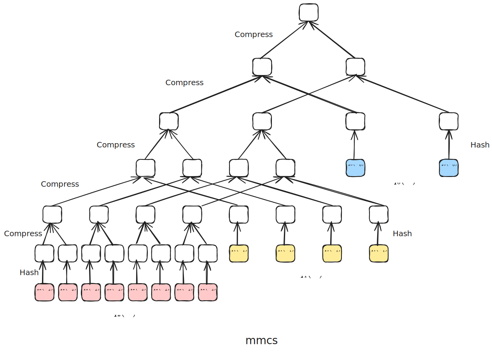
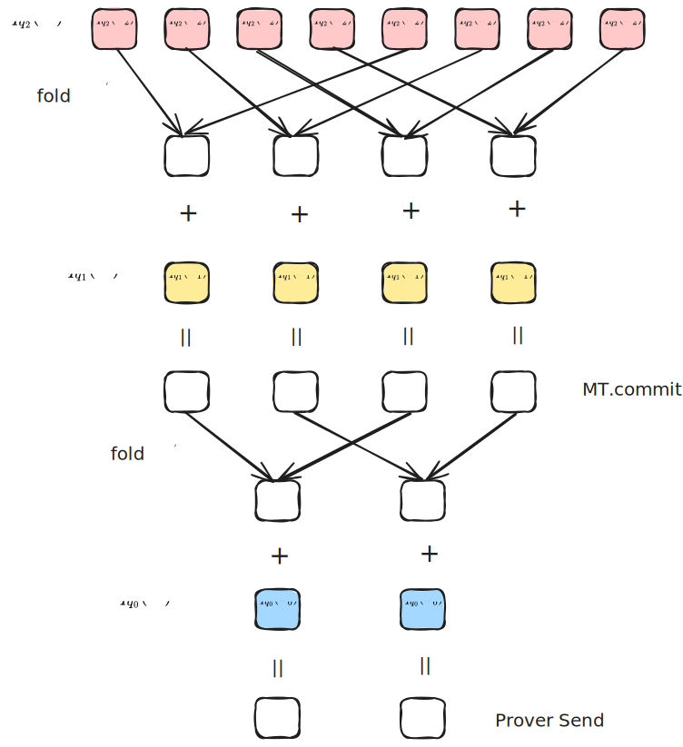
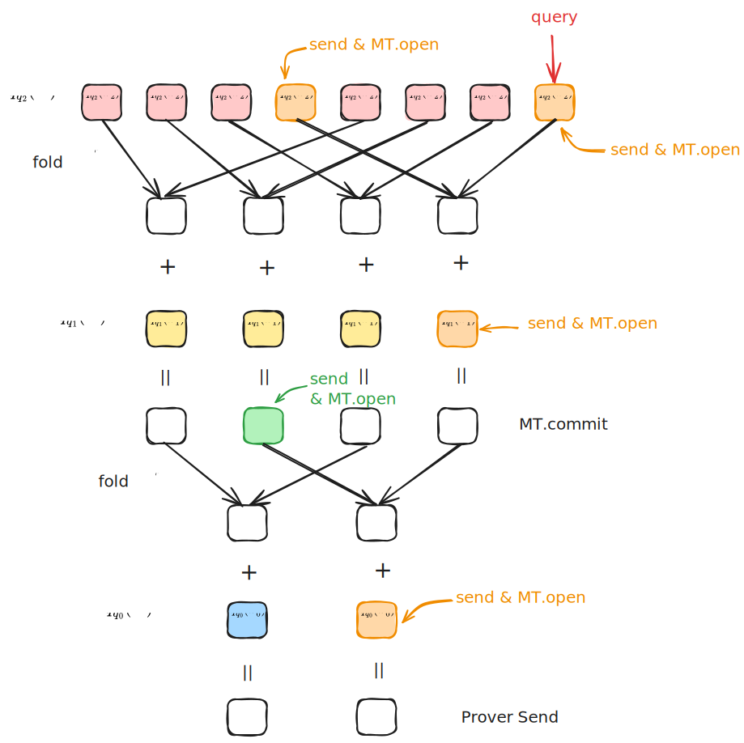

# Zeromorph-PCS

之前的文章介绍了 zeromorph 协议对接 KZG 做多元线性多项式的 PCS 协议，这里介绍 zeromorph 协议接 FRI 对应的 PCS 协议。

## 对接 FRI

在之前的文章中已经介绍过，zeromorph 协议最后转换为证明一个关键的等式

$$
\hat{f}(X) - v\cdot\Phi_n(X) = \sum_{k = 0}^{n - 1} \Big(X^{2^k}\cdot \Phi_{n-k-1}(X^{2^{k+1}}) - u_k\cdot\Phi_{n-k}(X^{2^k})\Big)\cdot \hat{q}_k(X)
$$

以及要求商多项式 $\hat{q}_k(X)$ 的次数都小于 $2^k$ ，来防止 Prover 作弊。

为了证明上面的等式成立，Verifier 可以随机选取一个点 $X = \zeta$ ，然后让 Prover 提供 $\hat{f}(\zeta)$ 和 $\hat{q}_k(\zeta)$ 的值，以便于 Verifier 验证下面的等式是否成立：

$$
\hat{f}(\zeta) - v\cdot\Phi_n(\zeta) = \sum_{k = 0}^{n - 1} \Big(\zeta^{2^k}\cdot \Phi_{n-k-1}(\zeta^{2^{k+1}}) - u_k\cdot\Phi_{n-k}(\zeta^{2^k})\Big)\cdot \hat{q}_k(\zeta)
$$

用 zeromorph 对接 FRI 协议时，可以用 FRI 协议实现的 PCS 来提供 $\hat{f}(\zeta)$ 和 $\hat{q}_k(\zeta)$ 的值，并用 FRI 协议的 low degree test 来证明 $\deg(\hat{q_k}) < 2^k$ 。

### Commit 阶段

要承诺一个有 $n$ 个未知数的 MLE 多项式，

$$
\tilde{f}(X_0, X_1, \ldots, X_{n-1}) = \sum_{i=0}^{N-1} a_i \cdot \overset{\sim}{eq}(\mathsf{bits}(i), (X_0, X_1, \ldots, X_{n-1}))
$$

首先直接将其在 hypercube 上的取值 $(a_0, \ldots, a_{N - 1})$ 映射到一元多项式 $\hat{f}(X)$ ，

$$
\hat{f}(X) = a_0 + a_1 X + \cdots + a_{N-1} X^{N - 1}
$$

对于 FRI 协议，选取 $\mathbb{F}$ 中的一个大小为 $2$ 的幂次的乘法子群 $D = D_0$ ，并且有

$$
D_r \subseteq D_{r - 1} \subseteq \ldots \subseteq D_0
$$

其中 $|D_{i - 1}|/|D_{i}| = 2$ ，码率 $\rho = N / |D_0|$ 。那么 FRI 协议对函数 $\hat{f}$ 的承诺为承诺 $\hat{f}(X)$ 在 $D$ 上的 Reed-Solomon 编码，即

$$
\mathsf{cm}(\hat{f}(X)) = \mathsf{cm}([\hat{f}(x)|_{x \in D}])
$$

实际实现中，一般用 Merkle 树来承诺 $[\hat{f}(x)|_{x \in D}]$ ，记为

$$
\mathsf{cm}(\hat{f}(X)) = \mathsf{MT.Commit}([\hat{f}(x)|_{x \in D}])
$$
Prover 发送的是这棵 Merkle 树的根节点值，作为 $[\hat{f}(x)|_{x \in D}]$ 的承诺。

### Evaluation 证明协议

#### 公共输入

- MLE 多项式 $\tilde{f}$ 的承诺 $\mathsf{cm}([[\tilde{f}]]_n)$
- 求值点 $\mathbf{u}=(u_0, u_1, \ldots, u_{n-1})$
- 求值结果 $v = \tilde{f}(\mathbf{u})$
- 码率参数：$\rho$

#### Witness

- MLE 多项式 $\tilde{f}$ 在 $n$ 维 HyperCube 上的点值向量 $\mathbf{a} = (a_0, a_1, \ldots, a_{2^n-1})$

#### Round 1

Prover 发送余数多项式的承诺

- 计算 $n$ 个余数 MLE 多项式， $\{\tilde{q}_k\}_{k=0}^{n-1}$ ，其满足

$$
\tilde{f}(X_0,X_1,\ldots, X_{n-1}) - v = \sum_{k=0}^{n-1} (X_k-u_k) \cdot \tilde{q}_k(X_0,X_1,\ldots, X_{k-1})
$$
- 构造余数 MLE 多项式所映射到的 Univariate 多项式 $\hat{q}_k=[[\tilde{q}_k]]_k, \quad 0 \leq k < n$
- 计算并发送它们的承诺：$\mathsf{cm}(\hat{q}_0), \mathsf{cm}(\hat{q}_1), \ldots, \mathsf{cm}(\hat{q}_{n-1})$ ，这里承诺 $\mathsf{cm}(\hat{q}_0), \mathsf{cm}(\hat{q}_1), \ldots, \mathsf{cm}(\hat{q}_{n-1})$ 为 $\hat{q}_0, \ldots, \hat{q}_{n - 1}$ 的 FRI 承诺，取 $\hat{q}_k$ 的乘法子群为 $D^{(k)} = D^{(k)}_0$ ，对应的承诺为

$$
\mathsf{cm}(\hat{q}_k(X)) = \mathsf{cm}([\hat{q}_k(x)|_{x \in D^{(k)}}]) = \mathsf{MT.commit}([\hat{q}_k(x)|_{x \in D^{(k)}}])
$$

其中 $|D^{(k)}| = 2^k / \rho$ 。

#### Round 2

1. Verifier 发送随机数 $\zeta \stackrel{\$}{\leftarrow} \mathbb{F} \setminus D$ 
2. Prover 计算并发送 $\hat{f}(\zeta)$ 
3. Prover 计算 

$$
q_{f_\zeta}(X) = \frac{\hat{f}(X) - \hat{f}(\zeta)}{X - \zeta}
$$
在 $D$ 上的值，即

$$
[q_{f_\zeta}(x)|_{x \in D}] = \big[\frac{\hat{f}(x) - \hat{f}(\zeta)}{ x - \zeta} \big|_{x \in D} \big]
$$

4. Prover 发送 $q_{f_\zeta}(X)$ 的承诺，$\mathsf{cm}(q_{f_\zeta}(X))$

$$
\mathsf{cm}(q_{f_\zeta}(X)) = \mathsf{cm}([q_{f_\zeta}(x)|_{x \in D}]) = \mathsf{MT.commit}([q_{f_\zeta}(x)|_{x \in D}])
$$
5. Prover 计算并发送 $\hat{q}_k(\zeta), \, 0 \le k < n$ 。
6. Prover 计算

$$
q_{\hat{q}_k}(X) = \frac{\hat{q_k}(X) - \hat{q}_k(\zeta)}{X - \zeta}
$$

其中 $0 \le k < n$ 。

7. Prover 发送 $q_{\hat{q}_k}(X)$ 的承诺，$\mathsf{cm}(q_{\hat{q}_k}(X))$ ，$0 \le k < n$

$$
\mathsf{cm}(q_{\hat{q}_k}(X)) = [q_{\hat{q}_k}(x)|_{x \in D^{(k)}}] = \mathsf{MT.commit}([q_{\hat{q}_k}(x)|_{x \in D^{(k)}}])
$$

#### Round 3

1. Verifier 发送随机数 $\gamma \stackrel{\$}{\leftarrow} D$
2. Prover 发送 $q_{f_\zeta}(\gamma)$ 以及 $\hat{f}(\gamma)$
3. Prover 发送 $q_{f_\zeta}(\gamma)$ 以及 $\hat{f}(\gamma)$ 在 Merkle Tree 上的打开路径，作为 $q_{f_\zeta}$ 与 $\hat{f}$ 在 $\gamma$ 点值的证明，记为

$$
\mathsf{MT.open}([\hat{f}(x)|_{x \in D}], \gamma)
$$

$$
\mathsf{MT.open}([q_{f_\zeta}(x)|_{x \in D}], \gamma)
$$

#### Round 4

1. Verifier 发送 $k$ 个随机数 $\gamma_k \stackrel{\$}{\leftarrow} D^{(k)}, 0 \le k < n$
2. Prover 发送  $\{ \hat{q}_k(\gamma_k) \}_{k = 0}^{n - 1}$  以及 $\{ q_{\hat{q}_k}(\gamma_k) \}_{k = 0}^{n - 1}$ 

> 📝 **Notes**
>
> 实际实现中，$D^{(k)}$ 的生成元满足 $\omega_k^2 = \omega_{k - 1}$ ，那么这里 Verifier 只需要发送一个随机数 $\gamma_{n - 1} \stackrel{\$}{\leftarrow} D^{(n - 1)}$ 即可，下一个随机数 $\gamma_{n - 2} = \gamma_{n - 1}^2$ ，以此类推。

3. Prover 发送  $\{ \hat{q}_k(\gamma_k) \}_{k = 0}^{n - 1}$ 以及 $\{ q_{\hat{q}_k}(\gamma_k) \}_{k = 0}^{n - 1}$ 对应的 Merkle Path，

$$
\mathsf{MT.open}([\hat{q}_k(x)|_{x \in D^{(k)}}],\gamma_k)
$$

$$
\mathsf{MT.open}([q_{\hat{q}_k}(x)|_{x \in D^{(k)}}],\gamma_k)
$$

#### Round 5

1. Prover 与 Verifier 进行 FRI 协议的 low degree test 交互，证明 $q_{f_\zeta}(X)$ 的次数小于 $2^n$ ，

$$
\mathsf{FRI.LDT}(q_{f_\zeta}(X), 2^n)
$$

2. Prover 发送 $q_{f_\zeta}(X)$ 的 low degree test 证明，

$$
\pi(\mathsf{FRI.LDT}(q_{f_\zeta}(X), 2^n))
$$

> 📝 **Notes**
>
> 在一般的 FRI 协议中进行 low degree test 时，会首先对对应的多项式进行 Merkle Tree 承诺，由于在 Round 2 已经承诺过了，因此这里在 $\mathsf{FRI.LDT}$ 的第一步中可以不用再重复进行承诺。

#### Round 6

1. Prover 与 Verifier 进行 FRI 协议的 low degree test 交互，对于 $0 \le k < n$ ，证明 $q_{\hat{q}_k}(X)$ 的次数小于 $2^k$ ，

$$
\mathsf{FRI.LDT}(q_{\hat{q}_k}(X), 2^k)
$$

2. Prover 发送 $q_{\hat{q}_k}(X)$ 的 low degree test 证明，

$$
\pi(\mathsf{FRI.LDT}(q_{\hat{q}_k}(X), 2^k))
$$

> 📝 **Notes**
>
> 这里的原因和 Round 4 一样，在 $\mathsf{FRI.LDT}$ 的第一步中可以不用再对 $q_{\hat{q}_k}(X)$ 重复进行承诺。

#### Proof

Prover 发送的证明有

$$
\pi = \big(\{\mathsf{cm}(\hat{q}_k(X))\}_{k = 0}^{n - 1}, \hat{f}(\zeta), \mathsf{cm}(q_{f_\zeta}(X)), \{\hat{q}_k(\zeta)\}_{k =0}^{n - 1}, \{\mathsf{cm}(q_{\hat{q}_k}(X))\}_{k =0}^{n-1}, \big)
$$

- [ ] 待协议确定后完善

#### Verification

Verifier

1. 验证 $q_{f_\zeta}(\gamma)$ 以及 $\hat{f}(\gamma)$ 发送过来值的正确性，通过 Prover 发送的 Merkle Tree Path 来进行验证，记为

$$
\mathsf{MT.verify}(\mathsf{MT.Commit}([\hat{f}(x)|_{x \in D}]), \mathsf{MT.open}([\hat{f}(x)|_{x \in D}], \gamma))
$$

$$
\mathsf{MT.verify}(\mathsf{MT.commit}([q_{f_\zeta}(x)|_{x \in D}]), \mathsf{MT.open}([q_{f_\zeta}(x)|_{x \in D}], \gamma))
$$

2. 验证 $q_{f_\zeta}$ 商式的正确性

$$
q_{f_\zeta}(\gamma) \cdot (\gamma - \zeta)= \hat{f}(\gamma) - \hat{f}(\zeta)
$$

3. 验证 $\{ \hat{q}_k(\gamma_k) \}_{k = 0}^{n - 1}$  以及 $\{ q_{\hat{q}_k}(\gamma_k) \}_{k = 0}^{n - 1}$  发送过来值的正确性，通过 Prover 发送的 Merkle Tree Path 来进行验证，记为

$$
\mathsf{MT.verify}(\mathsf{MT.commit}([\hat{q}_k(x)|_{x \in D^{(k)}}]), \mathsf{MT.open}([\hat{q}_k(x)|_{x \in D^{(k)}}],\gamma_k))
$$

$$
\mathsf{MT.verify}(\mathsf{MT.commit}([q_{\hat{q}_k}(x)|_{x \in D^{(k)}}]), \mathsf{MT.open}([q_{\hat{q}_k}(x)|_{x \in D^{(k)}}],\gamma_k))
$$

4. 验证 $q_{\hat{q}_k}$ 商式的正确性，对于 $k = 0, 1, \ldots, n - 1$ ，验证

$$
q_{\hat{q}_k}(\gamma_k) \cdot (\gamma_k - \zeta) = \hat{q}_k(\gamma_k) - \hat{q}_k(\zeta)
$$

5.  验证 FRI 协议 low degree test 的正确性

$$
\mathsf{FRI.verify}(\pi(\mathsf{FRI.LDT}(q_{f_\zeta}(X), 2^n)))
$$

$$
\mathsf{FRI.verify}(\pi(\mathsf{FRI.LDT}(q_{\hat{q}_k}(X), 2^k))), \, 0 \le k < n
$$

6. 计算 $\Phi_n(\zeta)$ 以及 $\Phi_{n - k}(\zeta^{2^k})(0 \le k < n)$ ，满足

$$
\Phi_n(\zeta) = 1 + \zeta + \zeta^2 + \ldots + \zeta^{2^n-1}
$$

$$
\Phi_{n-k}(\zeta^{2^k}) = 1 + \zeta^{2^k} + \zeta^{2\cdot 2^k} + \ldots + \zeta^{(2^{n-k}-1)\cdot 2^k}
$$

7. 验证下述等式的正确性

$$
\hat{f}(\zeta) - v\cdot\Phi_n(\zeta) = \sum_{k = 0}^{n - 1} \Big(\zeta^{2^k}\cdot \Phi_{n-k-1}(\zeta^{2^{k+1}}) - u_k\cdot\Phi_{n-k}(\zeta^{2^k})\Big)\cdot \hat{q}_k(\zeta)
$$

## Zeromorph 对接 FRI 优化协议

在上述的协议中，会对 $n$ 个一元多项式 $\hat{q}_k(X)$ 进行承诺以及用 FRI 协议分别进行 low degree test 的证明，实际上，由于要证明的 $\hat{q}_{k}(X)$ 与 $\hat{q}_{k - 1}(X)$ 之间的 degree bound 刚好相差 $2$ 倍，因此可以用 rolling batch 的技巧对这 $n$ 个多项式只进行一次 low degree test。

当对 $n$ 个一元多项式 $\hat{q}_k(X)$ 进行承诺时，由于 $D^{(k)}$ 与 $D^{(k - 1)}$ 之间的大小也正好相差 $2$ 倍，因此也可以借用 plonky3 中的 [mmcs](https://github.com/Plonky3/Plonky3/blob/main/merkle-tree/src/mmcs.rs) 结构对这 $n$ 个多项式放在一起只进行一次承诺。

这里先以 $3$ 个多项式 $\hat{q}_2(X), \hat{q}_1(X), \hat{q}_0(X)$ 为例来说明 mmcs 承诺的过程。设 $\rho = \frac{1}{2}$ ，Prover 要承诺的值为

$$
\mathsf{cm}(\hat{q}_2(X)) = [\hat{q}_2(x)|_{x\in D^{(2)}}] = \{\hat{q}_2(\omega_2^0), \hat{q}_2(\omega_2^1), \hat{q}_2(\omega_2^2), \ldots, \hat{q}_2(\omega_2^7)\} 
$$

$$
\mathsf{cm}(\hat{q}_1(X)) = [\hat{q}_1(x)|_{x\in D^{(1)}}] = \{\hat{q}_1(\omega_1^0), \hat{q}_1(\omega_1^1), \hat{q}_1(\omega_1^2), \hat{q}_1(\omega_1^3)\}
$$

$$
\mathsf{cm}(\hat{q}_0(X)) = [\hat{q}_0(x)|_{x\in D^{(0)}}] = \{\hat{q}_0(\omega_0^0), \hat{q}_0(\omega_0^1)\}
$$

其中 $\omega_2, \omega_1, \omega_0$ 分别是 $D^{(2)}, D^{(1)}, D^{(0)}$ 上的生成元，满足 

$$
(\omega_2)^8 = 1, (\omega_1)^4 = 1, (\omega_0)^2 = 1
$$

在实际实现中，可以选取 $\mathbb{F}_p^*$ 的生成元 $g$ 来生成 $\omega_2, \omega_1, \omega_0$ ，令

$$
\omega_2 = g^{\frac{p - 1}{8}}, \omega_1 = g^{\frac{p - 1}{4}},\omega_0 = g^{\frac{p - 1}{2}}
$$

由费马小定理可以验证 $(\omega_2)^8 = 1, (\omega_1)^4 = 1, (\omega_0)^2 = 1$ 是成立的，则它们之间满足关系式 $\omega^2 = \omega_1, \omega_1^2 = \omega_0$ 。

可以看到 $\mathsf{cm}(\hat{q}_2(X))$ 要承诺的有 8 个值，$\mathsf{cm}(\hat{q}_1(X))$ 要承诺的有 4 个值，而 $\mathsf{cm}(\hat{q}_0(X))$ 要承诺的有 2 个值。如果用 Merkle Tree 来承诺，需要 3 棵树来进行承诺，其高度分别是 3, 2, 1，而现在用 mmcs 结构，可以将这 14 个值放在同一棵树上，其高度为 6。

这种承诺方式记为

$$
\mathsf{MMCS.commit}(\hat{q}_2(X), \hat{q}_1(X), \hat{q}_0(X))
$$

下面依然以 $n = 3$ 为例来说明 rolling batch 的技巧，对于商多项式 $q_{\hat{q}_2}(X), q_{\hat{q}_1}(X), q_{\hat{q}_0}(X)$ ，如果用 FRI 的 low degree test 来证明它们的 degree bound ，需要 3 个相应的证明，而 rolling batch 技巧可以让我们用一次 low degree test 来证明这 3 个多项式的 degree bound，协议过程如下图所示。

将折叠之后的值与下一个 $q_{\hat{q}_{i - 1}}$ 的值相加，再进行 FRI 的折叠，直到最后折叠成常数多项式。

### Commit 阶段

这里承诺阶段与上述非优化版的承诺协议是一样的，承诺一个有 $n$ 个变量的 MLE 多项式，

$$
\tilde{f}(X_0, X_1, \ldots, X_{n-1}) = \sum_{i=0}^{N-1} a_i \cdot \overset{\sim}{eq}(\mathsf{bits}(i), (X_0, X_1, \ldots, X_{n-1}))
$$

先直接映射成一元多项式 $\hat{f}(X)$，为

$$
\hat{f}(X) = a_0 + a_1 X + \cdots + a_{N-1} X^{N - 1}
$$

其承诺为

$$
\mathsf{cm}(\hat{f}(X)) = [\hat{f}(x)|_{x \in D}]
$$

用一般的 Merkle Tree 来承诺，为

$$
\mathsf{cm}(\hat{f}(X)) = \mathsf{MT.Commit}([\hat{f}(x)|_{x \in D}])
$$

### Evaluation 证明协议

#### 公共输入

- MLE 多项式 $\tilde{f}$ 的承诺 $\mathsf{cm}([[\tilde{f}]]_n)$
- 求值点 $\mathbf{u}=(u_0, u_1, \ldots, u_{n-1})$
- 求值结果 $v = \tilde{f}(\mathbf{u})$
- 码率参数：$\rho$
- FRI 协议中进行 low degree test 查询阶段的重复查询的次数参数: $l$
- FRI 协议中编码的乘法子群：$D, D^{(0)}, \ldots, D^{(n - 1)}$ 

#### Witness

- MLE 多项式 $\tilde{f}$ 在 $n$ 维 HyperCube 上的点值向量 $\mathbf{a} = (a_0, a_1, \ldots, a_{2^n-1})$

#### Round 1

Prover 发送余数多项式的承诺

- 计算 $n$ 个余数 MLE 多项式， $\{\tilde{q}_k\}_{k=0}^{n-1}$ ，其满足

$$
\tilde{f}(X_0,X_1,\ldots, X_{n-1}) - v = \sum_{k=0}^{n-1} (X_k-u_k) \cdot \tilde{q}_k(X_0,X_1,\ldots, X_{k-1})
$$

- 构造余数 MLE 多项式所映射到的 Univariate 多项式 $\hat{q}_k=[[\tilde{q}_k]]_k, \quad 0 \leq k < n$
- 计算并发送它们的承诺，这里用 mmcs 结构对这 $n$ 个多项式的值放在同一棵树上进行承诺。先分别计算这些多项式在对应 $D^{(k)}$ 上的值，计算

$$
\{[\hat{q}_k(x)|_{x \in D^{(k)}}]\}_{k = 0}^{n - 1}
$$

其中 $|D^{(k)}| = 2^k / \rho$ ，再用 mmcs 对这 $(2^{n - 1} + 2^{n - 2} + \ldots + 2^0)/\rho$ 个值一次进行承诺，记为

$$
\mathsf{MMCS.commit}(\hat{q}_{n - 1}, \hat{q}_{n - 2}, \ldots, \hat{q}_0)
$$

#### Round 2

1. Verifier 发送随机数 $\zeta \stackrel{\$}{\leftarrow} \mathbb{F} \setminus D$ 
2. Prover 计算并发送 $\hat{f}(\zeta)$ 
3. Prover 计算 

$$
q_{f_\zeta}(X) = \frac{\hat{f}(X) - \hat{f}(\zeta)}{X - \zeta}
$$

在 $D$ 上的值，即

$$
[q_{f_\zeta}(x)|_{x \in D}] = \big[\frac{\hat{f}(x) - \hat{f}(\zeta)}{ x - \zeta} \big|_{x \in D} \big]
$$

4. Prover 发送 $q_{f_\zeta}(X)$ 的承诺，$\mathsf{cm}(q_{f_\zeta}(X))$

$$
\mathsf{cm}(q_{f_\zeta}(X)) = \mathsf{cm}([q_{f_\zeta}(x)|_{x \in D}])
$$

这里用 Merkle Tree 进行承诺，即

$$
\mathsf{MT.commit}([q_{f_\zeta}(x)|_{x \in D}])
$$

5. Prover 计算并发送 $\{\hat{q}_k(\zeta)\}_{k = 0}^{n - 1}$ 。
6. Prover 计算

$$
q_{\hat{q}_k}(X) = \frac{\hat{q_k}(X) - \hat{q}_k(\zeta)}{X - \zeta}, \, 0 \le k < n
$$

在 $D^{(k)}$ 上的值，即

$$
[q_{\hat{q}_k}(x)|_{x \in D^{(k)}}] = \big[\frac{\hat{q}_k(x) - \hat{q}_k(\zeta)}{ x - \zeta} \big|_{x \in D^{(k)}} \big]
$$
7. Prover 发送对应的承诺

$$
\mathsf{MMCS.commit}(q_{\hat{q}_{n - 1}}, q_{\hat{q}_{n - 2}}, \ldots, q_{\hat{q}_{0}})
$$
#### Round 3

1. Verifier 发送随机数 $\gamma \stackrel{\$}{\leftarrow} D$
2. Prover 发送 $q_{f_\zeta}(\gamma)$ 以及 $\hat{f}(\gamma)$
3. Prover 发送 $q_{f_\zeta}(\gamma)$ 以及 $\hat{f}(\gamma)$ 在 Merkle Tree 上的打开路径，作为 $q_{f_\zeta}$ 与 $\hat{f}$ 在 $\gamma$ 点值的证明，记为

$$
\mathsf{MT.open}([\hat{f}(x)|_{x \in D}], \gamma)
$$

$$
\mathsf{MT.open}([q_{f_\zeta}(x)|_{x \in D}], \gamma)
$$

#### Round 4

1. Verifier 发送 $k$ 个随机数 $\gamma_k \stackrel{\$}{\leftarrow} D^{(k)}, 0 \le k < n$
2. Prover 发送  $\{ \hat{q}_k(\gamma_k) \}_{k = 0}^{n - 1}$  以及 $\{ q_{\hat{q}_k}(\gamma_k) \}_{k = 0}^{n - 1}$ 

> 📝 **Notes**
>
> 实际实现中，$D^{(k)}$ 的生成元满足 $\omega_k^2 = \omega_{k - 1}$ ，那么这里 Verifier 只需要发送一个随机数 $\gamma_{n - 1} \stackrel{\$}{\leftarrow} D^{(n - 1)}$ 即可，下一个随机数 $\gamma_{n - 2} = \gamma_{n - 1}^2$ ，以此类推。

3. Prover 发送  $\{ \hat{q}_k(\gamma_k) \}_{k = 0}^{n - 1}$ 以及 $\{ q_{\hat{q}_k}(\gamma_k) \}_{k = 0}^{n - 1}$ 对应的 Merkle Path，

$$
\mathsf{MMCS.open}(\{[\hat{q}_k(x)|_{x \in D^{(k)}}]\}_{k = 0}^{n - 1},\gamma_k)
$$

$$
\mathsf{MMCS.open}(\{[q_{\hat{q}_k}(x)|_{x \in D^{(k)}}]\}_{k = 0}^{n - 1},\gamma_k)
$$

#### Round 5

1. Prover 与 Verifier 进行 FRI 协议的 low degree test 交互，证明 $q_{f_\zeta}(X)$ 的次数小于 $2^{n}$ ，

$$
\mathsf{FRI.LDT}(q_{f_\zeta}(X), 2^n)
$$

2. Prover 发送 $q_{f_\zeta}(X)$ 的 low degree test 证明，

$$
\pi(\mathsf{FRI.LDT}(q_{f_\zeta}(X), 2^n))
$$
> 📝 **Notes**
>
> 在一般的 FRI 协议中进行 low degree test 时，会首先对对应的多项式进行 Merkle Tree 承诺，由于在 Round 2 已经承诺过了，因此这里在 $\mathsf{FRI.LDT}$ 的第一步中可以不用再重复进行承诺。

#### Round 6

Prover 与 Verifier 进行 FRI 协议的 low degree test 交互，这里使用 rolling batch 技巧，对于 $0 \le k < n$ ， 一次证明 $q_{\hat{q}_k}(X)$ 的次数小于 $2^k$ ，记为

$$
\mathsf{OPFRI.LDT}(q_{\hat{q}_{n - 1}}, \ldots, q_{\hat{q}_{0}}, 2^{n - 1})
$$
Prover 发送 low degree test 的证明，

$$
\pi(\mathsf{OPFRI.LDT}(q_{\hat{q}_{n - 1}}, \ldots, q_{\hat{q}_{0}}, 2^{n - 1}))
$$

具体过程如下：

1. Prover 发送 $[q_{\hat{q}_{n - 1}}(x)|_{x\in D^{(n - 1)}}]$ 的承诺，即

$$
\mathsf{MT.commit}([q_{\hat{q}_{n - 1}}(x)|_{x\in D^{(n - 1)}}])
$$

2. Verifier 发送随机数 $\alpha^{(n - 1)}$

3. 初始化 $i = n - 1$ ，对于 $x \in D^{(n - 1)}$ ，初始化

$$
\mathsf{fold}^{(i)}(x) = q_{\hat{q}_{n - 1}}(x)
$$

当 $i > 0$ 时：

- 对于 $x \in D^{(i - 1)}$ ，Prover 计算

$$
\mathsf{fold}^{(i - 1)}(x) = \frac{\mathsf{fold}^{(i)}(x) + \mathsf{fold}^{(i)}(-x)}{2} + \alpha^{(i)} \cdot \frac{\mathsf{fold}^{(i)}(x) + \mathsf{fold}^{(i)}(-x)}{2x}
$$

-  对于 $x \in D^{(i - 1)}$ ，Prover 更新 $\mathsf{fold}^{(i - 1)}(x)$

$$
\mathsf{fold}^{(i - 1)}(x) = \mathsf{fold}^{(i - 1)}(x) + q_{\hat{q}_{i - 1}}(x)
$$

- 当 $i > 1$ 时，
  - Prover 发送 $\mathsf{fold}^{(i - 1)}(x)$ 的承诺，即

    $$
    \mathsf{MT.commit}([\mathsf{fold}^{(i - 1)}(x)|_{x \in D^{(i - 1)}}])
    $$
  - Verifier 发送随机数 $\alpha^{(i - 1)}$
- 当 $i = 1$ 时，由于最后折叠到常数多项式，Prover 选取 $D^{(0)}$ 中的任意一个点 $x_0 \in D^{(0)}$，发送折叠到最后的值 $\mathsf{fold}^{(0)}(x_0)$ 。
- 更新 $i = i - 1$ 。

#### Round 7

Verifier 重复查询 $l$ 次 ：
- Verifier 从 $D^{(n - 1)}$ 中随机选取一个数 $s^{(n - 1)} \in D^{(n - 1)}$
- Prover 发送 $q_{\hat{q}_{n - 1}}(s^{(n - 1)})$ 以及其 Merkle Tree 证明 

$$
\mathsf{MT.open}(q_{\hat{q}_{n - 1}}, s^{(n - 1)})
$$

- Prover 发送 $q_{\hat{q}_{n - 1}}(-s^{(n - 1)})$

- 对于 $i = n - 2, \ldots, 1$，
  - Prover 计算 $s^{(i)} = (s^{(i + 1)})^2$
  - Prover 发送 $q_{\hat{q}_{i}}(s^{(i)})$
  - Prover 发送 $\mathsf{fold}^{(i)}(-s^{(i)})$
  - Prover 发送 $\mathsf{fold}^{(i)}(s^{(i)})$ 的 Merkle Tree 证明

    $$
        \mathsf{MT.open}(\mathsf{fold}^{(i)}, s^{(i)})
    $$
- 对于 $i = 0$ 时，
  - Prover 计算 $s^{(0)} = (s^{(1)})^2$
  - Prover 发送 $q_{\hat{q}_0}(s^{(0)})$

> 📝 **Notes**
>
> 例如对 3 个多项式进行 query，query 选取的是 $q_{\hat{q}_2}(X)$ 中的最后一个元素 $\omega_2^7$，那么 Prover 需要发送的值是下图中绿色部分，打开的 Merkle Tree 是橙色边框标记的部分，即 Prover 会发送
>
> $$
> \{q_{\hat{q_2}}(\omega_2^7), q_{\hat{q_2}}(\omega_2^3), q_{\hat{q}_1}(\omega_1^3), \mathsf{fold}^{(1)}(\omega_1^1),  q_{\hat{q}_0}(\omega_0^1)\}
> $$
>
> 以及
>
> $$
> \mathsf{MT.open}(q_{\hat{q}_2}, \omega_2^7), \,\mathsf{MT.open}(\mathsf{fold}^{(1)}, \omega_1^3)
> $$
> 
> 

#### Proof

- [ ] 待协议确定后完善

#### Verification

Verifier 

1. 验证 $q_{f_\zeta}(\gamma)$ 以及 $\hat{f}(\gamma)$ 发送过来值的正确性，通过 Prover 发送的 Merkle Tree Path 来进行验证，记为

$$
\mathsf{MT.verify}(\mathsf{MT.Commit}([\hat{f}(x)|_{x \in D}]), \mathsf{MT.open}([\hat{f}(x)|_{x \in D}], \gamma))
$$

$$
\mathsf{MT.verify}(\mathsf{MT.commit}([q_{f_\zeta}(x)|_{x \in D}]), \mathsf{MT.open}([q_{f_\zeta}(x)|_{x \in D}], \gamma))
$$

2. 验证 $q_{f_\zeta}$ 商式的正确性

$$
q_{f_\zeta}(\gamma) \cdot (\gamma - \zeta)= \hat{f}(\gamma) - \hat{f}(\zeta)
$$
3. 验证 $\{ \hat{q}_k(\gamma_k) \}_{k = 0}^{n - 1}$  以及 $\{ q_{\hat{q}_k}(\gamma_k) \}_{k = 0}^{n - 1}$  发送过来值的正确性，通过 Prover 发送的 Merkle Tree Path 来进行验证，记为

$$
\mathsf{MMCS.verify}(\mathsf{MMCS.commit}(\hat{q}_{n - 1}, \hat{q}_{n - 2}, \ldots, \hat{q}_0), \mathsf{MMCS.open}(\{[\hat{q}_k(x)|_{x \in D^{(k)}}]\}_{k = 0}^{n - 1},\gamma_k))
$$

$$
\mathsf{MMCS.verify}(\mathsf{MMCS.commit}(q_{\hat{q}_{n - 1}}, q_{\hat{q}_{n - 2}}, \ldots, q_{\hat{q}_{0}}), \mathsf{MMCS.open}(\{[q_{\hat{q}_k}(x)|_{x \in D^{(k)}}]\}_{k = 0}^{n - 1},\gamma_k))
$$

4. 验证 $q_{\hat{q}_k}$ 商式的正确性，对于 $k = 0, 1, \ldots, n - 1$ ，验证

$$
q_{\hat{q}_k}(\gamma_k) \cdot (\gamma_k - \zeta) = \hat{q}_k(\gamma_k) - \hat{q}_k(\zeta)
$$

5. 对 $n$ 个商多项式 $\{q_{\hat{q}_k}\}_{k = 0}^{n - 1}$ 一次进行 low degree test 的验证，记为

$$
\mathsf{OPFRI.verify}(\pi(\mathsf{OPFRI.LDT}(q_{\hat{q}_{n - 1}}, \ldots, q_{\hat{q}_{0}}, 2^{n - 1})))
$$

具体过程如下：

Verifier 重复 $l$ 次：

- Verifier 验证 $\hat{q}_{n - 1}(s^{(n - 1)})$ 的 Merkle Tree 证明

$$
\mathsf{MT.verify}(\mathsf{MT.commit}([q_{\hat{q}_{n - 1}}(x)|_{x\in D^{(n - 1)}}]),\mathsf{MT.open}(q_{\hat{q}_{n - 1}}, s^{(n - 1)}))
$$

- 初始化 $\mathsf{fold}$ 的值为 

    $$
        \mathsf{fold} = \frac{q_{\hat{q}_{n - 1}}(s^{(n - 1)}) + q_{\hat{q}_{n - 1}}(-s^{(n - 1)})}{2} + \alpha^{(n - 1)} \cdot \frac{q_{\hat{q}_{n - 1}}(s^{(n - 1)}) + q_{\hat{q}_{n - 1}}(-s^{(n - 1)})}{2 \cdot s^{(n - 1)}}
    $$

- 对于 $i = n - 2, \ldots , 1$
  - Verifier 计算 $s^{(i)} = (s^{(i + 1)})^2$
  - Verifier 验证 $\mathsf{fold}^{(i)}(s^{(i)})$ 的 Merkle Tree 证明
    $$
        \mathsf{MT.verify}(\mathsf{MT.commit}([\mathsf{fold}^{(i)}(x)|_{x \in D^{(i)}}]),\mathsf{MT.open}(\mathsf{fold}^{(i)}, s^{(i)}))
    $$
  - 更新 $\mathsf{fold}$ 的值为

    $$
    \mathsf{fold} = \mathsf{fold} + q_{\hat{q}_{i}}(s^{(i)})
    $$ 

  - 更新 $\mathsf{fold}$ 的值
  
    $$
        \mathsf{fold} = \frac{\mathsf{fold}^{(i)}(-s^{(i)}) + \mathsf{fold}}{2} + \alpha^{(i)} \cdot \frac{\mathsf{fold}^{(i)}(-s^{(i)}) - \mathsf{fold}}{2 \cdot s^{(i)}}
    $$

- 对于 $i = 0$ 时
  - Verifier 计算 $s^{(0)} = (s^{(1)})^2$
  - Verifier 验证下面式子的正确性
  
    $$    
        \mathsf{fold}^{(0)}(x_0) = \mathsf{fold} + q_{\hat{q}_0}(s^{(0)})
    $$

> 📝 **Notes**
> 
> 例如对于前面 Verifier 查询的例子，这里 Verifier 通过 Prover 发送的值，计算图中紫色的值，以及验证 Prover 发送的关于橙色部分的 Merkle Tree 的证明，最后 Verifier 验证自己计算得到的最后一个紫色部分的值是否等于 Prover 之前发送的值。
> 
> 

6. 计算 $\Phi_n(\zeta)$ 以及 $\Phi_{n - k}(\zeta^{2^k})(0 \le k < n)$ ，满足

$$
\Phi_n(\zeta) = 1 + \zeta + \zeta^2 + \ldots + \zeta^{2^n-1}
$$

$$
\Phi_{n-k}(\zeta^{2^k}) = 1 + \zeta^{2^k} + \zeta^{2\cdot 2^k} + \ldots + \zeta^{(2^{n-k}-1)\cdot 2^k}
$$

7. 验证下述等式的正确性

$$
\hat{f}(\zeta) - v\cdot\Phi_n(\zeta) = \sum_{k = 0}^{n - 1} \Big(\zeta^{2^k}\cdot \Phi_{n-k-1}(\zeta^{2^{k+1}}) - u_k\cdot\Phi_{n-k}(\zeta^{2^k})\Big)\cdot \hat{q}_k(\zeta)
$$